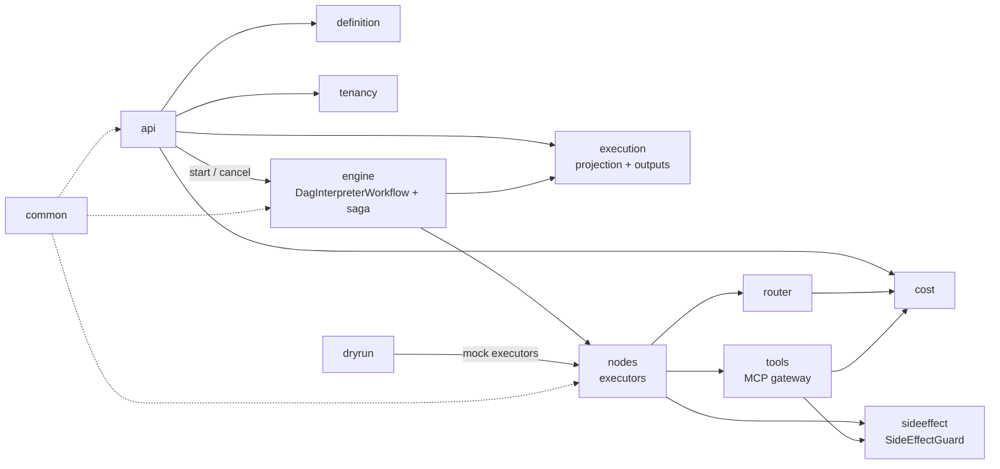

# 06 — End-to-End Execution Plan & Module Specs

> Status: **v4 (2026-10-02)**, revised after adversarial reviews round 1 (§11), round 2 (§12, traced against the assignment PDF) and round 3 (§13, review of v3). This is the **authoritative schedule**; where 03 and 06 differ on hours, ordering or scope, 06 wins. Risk rationale stays in [03](./03-baseline-plan.md).
> Time box: **16.0 h of core build and docs**, at the assignment's upper bound ("roughly 12–16 hours … do not gold-plate"). Design rationale: [01](./01-requirements-and-design-exploration.md), [04](./04-local-db-analysis.md), [05](./05-sagas-transactions-and-concurrency.md).
> Assignment priority rule (PDF, "If you run short"): **a correct core engine (§4) plus a strong design document** beat a broad but shallow build. Both are never-cut.

---

## 0. Canonical vocabulary (shared by 01, 03, 05 and 06)

| Concept | Values |
|---|---|
| Execution mode | `LIVE` · `DRY_RUN` · `REPLAY` (stretch) |
| Execution status | `QUEUED → RUNNING → {SUCCEEDED · FAILED · CANCELLED · TIMED_OUT · COMPENSATING → COMPENSATED · COMPENSATION_FAILED · NEEDS_ATTENTION}` · `START_FAILED` (admission) |
| Node status (per phase `FORWARD`/`COMPENSATE`) | `PENDING → RUNNING → {SUCCEEDED · FAILED · SKIPPED · CANCELLED · NEEDS_ATTENTION}` |
| Ledger state | `PENDING · COMMITTED · UNKNOWN · FAILED` |
| Tool reversibility | `COMPENSATABLE · PIVOT · RETRIABLE · READ_ONLY` |
| Tool idempotency | `NATIVE_KEY · LOOKUP · NONE` |
| Limit error codes | `RATE_LIMITED` · `CONCURRENCY_LIMIT` · `BUDGET_EXCEEDED` · `TOKEN_BUDGET_EXCEEDED` · `NODE_EXEC_LIMIT` · `FANOUT_LIMIT` · `TOOL_CALL_LIMIT` |
| Optimistic-lock column | `workflow_execution.row_version` (the definition version stays `def_version`; the API field is `version`, as in the PDF) |
| API keys | `api_key(key_hash PK, tenant_id, scopes)` (replaces `tenant.api_key_hash` in 01) |

---

## 1. Requirements traceability (assignment PDF → plan)

Status: ✅ built and demonstrated · 🟡 built slice + design doc · 📄 design doc only.

| PDF § | Requirement | Status | Where in the plan | Proof |
|---|---|---|---|---|
| Intro | 12–16 h, no gold-plating; core engine + design doc first | ✅ | §6 schedule = 16.0 h; never-cut list | — |
| Intro / §16 | README: AI-tool usage, where overridden; assumptions | ✅ | `docs/ai-usage.md` kept from P0; README in P10 | README |
| §2 | Node kinds: HTTP, LLM, MCP/tool, custom operator, condition, parallel, retries/timeouts, approval, side-effecting | ✅ except approval 🟡 | `nodes`, `engine`; custom operator = `NodeExecutor` SPI; approval node is stretch | P2a tests |
| §3 | 10k tenants, 1M/day, 500/s peak, 5–50 nodes, **fan-out 100**, 99.95 %, 99.9 % | 🟡 | `forEach` (§4.4) delivers 100-way fan-out in a ≤ 50-node workflow; capacity math from 01 §2 in the design doc | k6 + extrapolation |
| §4 | Sequential, parallel, dependencies, retries, timeouts, failure handling, cancellation, persistent state, versioning | ✅ | `engine`, `execution`, `definition`; **PDF example JSON accepted verbatim** | P2a 10 tests |
| §5 | Router: availability, rate limits, cost, latency, capability, tenant config, priority; vLLM p95 > 2 s scenario | ✅ | `router`: per-provider token buckets at the PDF's capacities, health state machine | Degradation + spill tests, script |
| §6 | MCP-style tools; **AI node selects/invokes a tool and consumes the result**; discovery, validation, timeouts/retries, authN/Z, failures, side effects, audit | ✅ | `tools` gateway; `llm` node bounded tool round (§4.6) | Gateway tests, audit rows |
| §7 | Dry-run per the PDF example (Fetch + LLM live, CRM + Send mocked); declare side effects; mocking; preview; determinism; code reuse | ✅ (replay 🟡) | `dryrun` policy (§4.10); `REPLAY` is stretch, design doc explains it | Dry-run tests |
| §8 | Guarantee, key generation/persistence, duplicate detection, retries × side effects, tx boundaries, crash between effect and persist; exactly-once question | 🟡 | `sideeffect` ledger slice + design doc | Crash test, walk-through script |
| §9 | Node 4 at 15 s vs 10 s timeout, 7 variations | 🟡 | `sideeffect` lease + `nextRetryDelay`; walk-through script covers overlap, crash, network loss, rate limit; the rest in the design doc table | `failure-walkthrough.sh` |
| §10 | Rate limits, concurrency, quotas, priority, fair scheduling, noisy neighbour, cost controls; 100k answer | 🟡 | `tenancy`: token bucket + soft concurrency cap + 429; DRR backlog is the design-doc answer | Admission-isolation test |
| §11 | Max cost, tokens, time, node executions, retries, fan-out; **layer per limit** | 🟡 | `cost`, validator, workflow counters; layer table in the design doc | Runaway test |
| §12 | Operator questions; 9 metrics; tracing **or equivalent** | ✅ | `observability`; `/trace` timeline is the end-to-end trace; Jaeger is stretch | `/actuator/prometheus`, `/trace` output |
| §13 | Engine, REST API, persistence, worker model, retries, router, MCP, dry-run, tests, load test; architecture diagram; README | ✅ | All phases; `docs/architecture.svg` in P10 | DoD §9 |
| §14 | Design doc ≤ 5 pages covering 13 topics | ✅ | Skeleton at end of D1, finalised in P10; page budget §8.1 | `docs/design.pdf` |
| §15 | Throughput, p50/p95/p99, CPU/mem, DB load, queue depth, bottleneck, 10× plan | ✅ | P9 capture script (§4.15) | `loadtest/RESULTS.md` |
| §17 | Git repo; design doc as **PDF**; minimal-setup start (one compose command) | ✅ | `docker compose --profile lite --profile app up` is the README's primary path | DoD §9 |

---

## 2. Module map

There is one deployable Spring Boot app (`app/`) built from package-modules under `com.conversive.aep`, plus `mocks/`.



**Enforced rules:**
1. **ArchUnit (one rule):** `engine.workflow` imports only `engine.*`, `common` and Temporal workflow APIs, with no Spring, JDBC, `Instant.now`, `Random` or `Thread`.
2. **Convention (checked by review, not tooling):** only `*.persistence` uses JDBC, and every tenant-scoped query filters on `tenant_id`, including `node_run` and `node_output`.
3. **`OutboundClient` is the only HTTP egress.** It:
   - propagates OTel context
   - enforces the HTTP timeout **`httpTimeout = node StartToClose − 1 s`** (so the client never outlives its activity attempt)
   - sets `Idempotency-Key`
   - applies an **SSRF deny-list** (private ranges, metadata IPs, **the platform's own API host**, which blocks self-triggering loops) except for allow-listed mock hosts
   - **refuses non-allow-listed hosts when the execution mode ≠ `LIVE`**, except calls the dry-run policy (§4.10) explicitly allows

---

## 3. End-to-end request flow

```mermaid
sequenceDiagram
  autonumber
  participant C as Client
  participant API as api
  participant DB as Postgres (app)
  participant TS as Temporal
  participant W as DagInterpreterWorkflow
  participant A as NodeActivity
  participant G as SideEffectGuard
  participant X as External (mock)

  C->>API: POST /v1/workflows/{id}/executions (Idempotency-Key)
  API->>DB: SELECT by (tenant, idem_key) → exists? return 202 same executionId
  API->>API: rate limit (token bucket) → 429 RATE_LIMITED
  API->>DB: soft concurrency check (live rows) → 429 CONCURRENCY_LIMIT
  API->>DB: INSERT workflow_execution(QUEUED, deadline_at)
  API->>TS: start id=exec:{tenant}:{execId} (inline retry ×3; already-started = success)
  alt start failed
    API->>DB: CAS QUEUED→START_FAILED
    API-->>C: 503 Retry-After
  else started
    API-->>C: 202 {executionId}
  end
  TS->>W: run(FrozenDefinition, input, mode)
  loop ready set non-empty (forEach expands to ≤ 100 items)
    W->>A: activity node(n, item) [side-effecting: WAIT_CANCELLATION_COMPLETED]
    A->>G: guard(effectKey, attempt)
    G->>DB: ledger PENDING(owner_attempt, lease_until)
    G->>X: call (Idempotency-Key, httpTimeout)
    G->>DB: PENDING|UNKNOWN → COMMITTED + node_output
    A-->>W: NodeOutputRef
    W->>W: saga.addCompensation(n)
  end
  W->>A: local activity: terminal CAS (detached scope)
  Note over W: FAIL_WORKFLOW / cancel / deadline → cancel siblings and WAIT →<br/>reconcile-then-compensate every compensatable node with a ledger row →<br/>saga.compensate() in reverse completion order (detached scope)
```

**Key decisions:**
- **Idempotency check comes first.** A retried POST consumes no rate-limit token, concurrency slot or budget.
- **Over-cap admissions are rejected, not queued.** `429 CONCURRENCY_LIMIT` + `Retry-After` pushes back on the client. The DRR backlog (`execution_queue`) from 01 is the **design-doc answer** for production and for "Tenant A submits 100,000 executions"; the README states that the prototype implements the rejecting variant.
- **There is no sweeper.** Start failure → inline retry → `START_FAILED` + 503.
- **The execution deadline is an in-workflow timer**; Temporal's own timeout is set 1 h higher as a backstop.
- **Payloads stay out of history:** activities write `node_output` and return a `NodeOutputRef`; outputs under 2 KB are inlined for conditions.

---

## 4. Module specifications

### 4.1 `common` (P0)
- **Contents:**
  - Typed ids; `TenantContext` (plus MDC).
  - Error taxonomy: `RetryableError` and `NonRetryableError(code)` → `ApplicationFailure.newNonRetryableFailure`; `RetryableError` may carry `nextRetryDelay`.
  - Jackson config; `OutboundClient` (§2 rule 3); injectable `Clock`.
- **`EffectKey`:** `sha256(tenant:exec:node:phase:callIndex)`, where `callIndex` = `forEach` item index (default 0). Computed in exactly one place.
- **Tests:** EffectKey stable across attempts, differs by phase and callIndex; the determinism ArchUnit rule.

### 4.2 `api` (P1)
- **Endpoints:**
  - POST `/v1/workflows` (accepts the **PDF §4 example JSON verbatim**: `workflow_id`, `version`, `nodes[{id,type,config}]`)
  - GET `/v1/workflows/{id}/versions/{v}`
  - POST `/v1/workflows/{id}/executions` (`mode`, `input`, `version?`, `dryRun{mockLlm?, allowReadOnly?}`; `Idempotency-Key`)
  - GET `/v1/executions/{id}`, `/nodes`, `/preview`, `/trace`
  - DELETE `/v1/executions/{id}` (cancel)
  - GET `/v1/tools`
- **Error envelope:** `{data, error:{code,message}, meta}`.
- **Table:** `api_key` (SHA-256 hash).
- **Decisions:** another tenant's resource returns 404; 429 and 503 carry `Retry-After`; "Run Again" = a new POST with a new key (new effects, by design, 01 §7); an optional `business_key` dedupe is design-only.
- **Tests:** contract tests (incl. **posting the PDF example unchanged**); cross-tenant 404; idempotent POST returns the same id and consumes no token; Temporal start failure → 503 + `START_FAILED`.

### 4.3 `definition` (P1)
- **Model:** `WorkflowDefinition`, `NodeSpec` (`depends_on`, `forEach{items, maxConcurrency}`, `retry`, `timeoutS`, `side_effecting`, `compensate`), `maxDurationS`, `limits{maxCostUsd, maxTokens, maxNodeExecutions}`; `FrozenDefinition` goes into the workflow input.
- **Implicit ordering (assumption, stated in the README):** a node **without** `depends_on` depends on the previous node in list order, so the PDF example runs sequentially; `depends_on: []` marks an explicit root.
- **Table:** `workflow_definition(tenant_id, workflow_id, def_version, spec JSONB, sha256)`.
- **Validator errors:**
  - cyclic graph, missing dependency
  - more than 50 nodes; static parallel width or `forEach.maxConcurrency` over 100
  - unknown node type or tool; condition doesn't parse
  - timeouts outside platform caps; **`retry.maxAttempts` > 5**; `ScheduleToClose` shorter than `StartToClose + lease grace`
  - limits above the tenant's ceilings
  - `compensate` on a node with no side effect
- **Validator warnings:** compensatable node after a pivot; more than one pivot per path; side-effecting node with neither `compensate` nor `pivot`.
- **Tests:** table-driven.

### 4.4 `engine` (P2a + P2b) ★
- **P2a (interpreter, 4.0 h):**
  1. Compute the ready set.
  2. Run up to `maxParallel` activities (default 16, cap 100) via `Async.function`; loop on `Promise.anyOf`.
  3. **`forEach`:** resolve `items` from upstream output at runtime; more than 100 items → non-retryable `FANOUT_LIMIT`; one activity per item with `callIndex = i`; output = array of refs.
  4. Condition nodes evaluate in-workflow and mark untaken branches SKIPPED.
  5. `CONTINUE` policy: mark the node failed and SKIP its dependants.
  6. Version pinning from the frozen definition.
  7. In-workflow deadline timer → `TIMED_OUT`.
  8. **Workflow-side counters:** node executions (default cap 500 per execution → `NODE_EXEC_LIMIT`), cost and tokens (fed by activity results → `BUDGET_EXCEEDED` / `TOKEN_BUDGET_EXCEEDED`). The 500 cap also bounds history (~6 events per activity ⇒ ≤ ~3 k events, well under Temporal's 10 k warning); child workflow per `forEach` is the documented route beyond that.
- **Activity options per node:** StartToClose = node timeout; ScheduleToClose = timeout × (attempts + 1) + backoff; heartbeat 5 s for long nodes; side-effecting nodes use `WAIT_CANCELLATION_COMPLETED`.
- **P2b (saga, 0.75 h — trimmed to the linear path):**
  - `Saga(continueWithError=true)`; `addCompensation` when a compensatable node succeeds.
  - On `FAIL_WORKFLOW`, cancel or deadline: cancel the in-flight scope and wait for it to settle, then reconcile-then-compensate every compensatable node with a ledger row.
  - `saga.compensate()` and terminal projections run in `Workflow.newDetachedCancellationScope`.
  - Diamond / parallel-branch compensation ordering: **design doc only** (05 §2).
- **Approval node:** stretch (signal + timer); design doc covers it.
- **No `getVersion` for v1**; it is the documented procedure for the first change.
- **Surface:** query `snapshot()`; signal `approve` only if the stretch lands.
- **Tests:**
  - **P2a (10):** sequential (PDF example) · parallel diamond · dependency order · retry-then-succeed · timeout · fail-fast vs continue · cancel mid-flight · v3 unaffected by a v4 publish · condition skip · **`forEach` of 100 items with `maxConcurrency` 16**
  - **P2b (3):** saga chain (charge → send fails → one refund) · **sibling fails while a charge is in flight → exactly one refund** · terminal CAS never overwritten
  - Worker-restart-resumes is a scripted demo on `lite`.

### 4.5 `execution` (P0 schema, P2a CAS)
- **Tables (all carry `tenant_id`):**
  - `workflow_execution(id, tenant_id, workflow_id, def_version, mode, status, row_version, idempotency_key UNIQUE(tenant_id, idempotency_key), source_execution_id, started_at, deadline_at, ended_at)`
  - `node_run(tenant_id, execution_id, node_id, call_index, phase, attempt, status, error_code, started_at, ended_at, …)`, PK `(execution_id, node_id, call_index, phase, attempt)`
  - `node_output(tenant_id, execution_id, node_id, call_index, attempt, payload JSONB, sha256)`
- **CAS:** `UPDATE … SET status=:to, row_version=row_version+1 WHERE id=:id AND status = ANY(:allowedFrom)`; zero rows is an idempotent no-op.
- **Soft concurrency cap (derived, no counter, no lock):** `count(*) WHERE tenant_id=? AND status IN ('QUEUED','RUNNING') AND deadline_at > now()` on a partial index.
  - Overshoot is bounded by the number of concurrent admitters for that tenant; it is documented, and the test asserts the bound.
  - `deadline_at` stops slots leaking forever when a run is terminated outside workflow code (Temporal terminate, backstop timeout).
- **`/trace` timeline (P8):** built from `node_run` + `llm_call` + `tool_call_audit`: per node start/end, attempts, error, provider + router reason, tokens, cost. This is the PDF §12 "equivalent end-to-end execution trace".
- **Tests:** a 10-thread CAS race ends with exactly one terminal state.

### 4.6 `nodes` (P2a, P3, P4)
- **SPI:** `NodeExecutor.execute(NodeContext)`; `ExecutorRegistry.resolve(type, mode)`. A "custom operator" (PDF §2) is a registered `NodeExecutor`.
- **Executors:** Http · Llm → `router` · McpTool → `tools` · Condition (workflow-side).
- **Llm with `tools` (PDF §6 "AI node selects a tool and consumes its result", P4):**
  - Config `tools: [toolName…]`, `maxToolCalls` (default 1, cap 3 → `TOOL_CALL_LIMIT`).
  - Loop inside one activity: LLM → `tool_call` → `ToolGateway.invoke` (scope check, schema validation, audit) → LLM with the result.
  - Only **READ_ONLY** tools may be AI-selected; side-effecting tools stay fixed `mcp` nodes so the saga and ledger see every effect. The validator rejects anything else.
  - Each LLM turn passes through the router and `cost`.
- **Rule:** side-effecting executors call only through `SideEffectGuard`.
- **Tests:** WireMock error mapping (timeout → retryable, 4xx → non-retryable, 429 → retryable with `Retry-After` as `nextRetryDelay`); the AI tool round (mock LLM returns a `tool_call`, final output uses the tool result).

### 4.7 `router` (P3)
- **Providers:** seeded with the PDF's example: A 200 ms / $0.010 / 100 RPS · B 500 ms / $0.004 / 500 RPS · vLLM 100 ms / $0.002 / 200 RPS.
- **Pipeline:**
  - Filter on capability, tenant allow-list, state ≠ OPEN and **per-provider token bucket** (capacity from config; per tenant × provider is design-only).
  - Score with priority-weighted `cost / p95 / errRate`; DEGRADED adds a penalty.
  - Fallback to at most 2 more providers, sharing the node's attempt budget.
  - **Spill:** when vLLM's bucket is empty, NORMAL/LOW priority goes to B and HIGH goes to A (01 §9).
- **Health state machine:** 10 s windows, 6-window lookback; a window with fewer than **N = 20 samples** is ignored.

  | From | To | Condition |
  |---|---|---|
  | HEALTHY | DEGRADED | p95 > 2 s in 2 consecutive qualifying windows (detection ≈ 20 s) |
  | any | OPEN | error rate > 50 % or p95 > 5 s in a qualifying window |
  | OPEN | HALF_OPEN | after 30 s |
  | HALF_OPEN | HEALTHY / OPEN | after 10 probe calls, by outcome |
  | DEGRADED | HEALTHY | p95 ≤ 1.5 s in 3 consecutive qualifying windows |
  | DEGRADED | — | always receives a **deterministic 5 % probe share** (every 20th eligible request) |
- **Table:** `llm_call` (candidates, reason, tokens, cost, latency, outcome).
- **Tests:** scoring per priority · filter · degradation scenario (injectable clock) · DEGRADED recovers via probes · empty window doesn't change state · **bucket exhausted → spill to B**.
- **Demo:** `vllm-degradation.sh` drives ≥ 5 req/s so each window qualifies.

### 4.8 `tools` (P5 registry, P4 gateway)
- **P5:** `tool_registry`: schema, scopes, timeout, retry, `reversibility`, `idempotency`, `compensation`; seeds `payments.charge`, `payments.refund`, `messaging.send`, `crm.upsert`, `crm.get`, `leads.fetch`.
- **P4 gateway** (`ToolGateway.invoke`), in order: grant/scope check → JSON-schema validation (networknt) → guard (side-effecting only) → audit.
- **MCP-style transport:** the `mocks` service exposes a minimal **JSON-RPC 2.0** endpoint with `tools/list` and `tools/call`; the gateway calls it via `OutboundClient`. The MCP Java SDK client is optional (the PDF: "you do not need a full MCP server").
- **AuthN/Z boundary:** per-tenant tool credentials live in the gateway (env-backed in the prototype) and are injected per call; they never appear in definitions, LLM prompts or `node_output`.
- **Tables:** `tenant_tool_grant`, `tool_call_audit` (one row per attempt, args hashed).
- **Tests:** invalid args → non-retryable · missing scope → `TOOL_FORBIDDEN` · timeout retried · one audit row per attempt · `tools/call` round trip.

### 4.9 `sideeffect` (P5) ★
- **Table:** `side_effect_ledger(effect_key PK, tenant_id, execution_id, node_id, phase, call_index, state, idempotency_mode, owner_attempt, lease_until, external_ref, response_ref, created_at, updated_at)`.
- **Timing contract (PDF §9: timeout 10 s, API succeeds at 15 s):**
  - `httpTimeout = StartToClose − 1 s` (9 s): the attempt's client gives up before Temporal times the attempt out.
  - `lease_until = now + StartToClose + 5 s` (15 s).
  - **The external call can still succeed server-side after our client gave up.** That success is learned only through reconciliation, never through the original attempt.
- **Protocol (`run(effectKey, attempt, call)`):**
  1. `INSERT … ON CONFLICT DO NOTHING`, then read the row.
     - **COMMITTED** → return the stored response.
     - **PENDING, lease live** → throw retryable `EFFECT_IN_PROGRESS` with **`nextRetryDelay = lease_until − now`**, so the retry lands after the lease rather than burning attempts.
     - **PENDING, lease expired** → take ownership (CAS on `owner_attempt`), then reconcile by mode: NATIVE_KEY → re-call with the same key (the provider returns the original result) · LOOKUP → query by business key · NONE → UNKNOWN + node `NEEDS_ATTENTION`.
  2. Make the call outside any transaction.
  3. Commit with `UPDATE … SET state='COMMITTED' WHERE effect_key=:k AND state IN ('PENDING','UNKNOWN')`.
- **Mocks:** payments returns **409 for an in-flight request with the same `Idempotency-Key`** (→ `EFFECT_IN_PROGRESS`) and the stored response for a completed one.
- **Compensation:** phase `COMPENSATE`, same key scheme; reconcile the forward effect first (COMMITTED → compensate; FAILED/absent → skip; UNKNOWN → LOOKUP else `NEEDS_ATTENTION`); executed pivot → `COMPENSATION_FAILED` + audit.
- **Tests (5):**
  1. no double charge after a crash between call and commit
  2. **PDF §9, NATIVE_KEY:** API completes at 15 s, attempt 1 times out at 10 s → attempt 2 is delayed to the lease end → re-call returns the stored result → exactly one charge, node SUCCEEDED
  3. **PDF §9, NONE:** same timing → no second call, node `NEEDS_ATTENTION`
  4. refund always returns 500 → bounded retries → `COMPENSATION_FAILED`
  5. an UNKNOWN forward effect gets no blind compensation
- **Cut:** `EFFECT_KEY_CONFLICT` request-hash check; crash-during-compensation and pivot-escalation tests (design doc).

### 4.10 `dryrun` (P6)
- **Policy (matches the PDF §7 example: Fetch Leads and LLM Classification live; CRM Update and Send Message mocked):**

  | Node | Default in `DRY_RUN` | Override |
  |---|---|---|
  | `llm` | **live** (budgeted, tagged `mode=DRY_RUN`) | `dryRun.mockLlm=true` |
  | tool with `reversibility=READ_ONLY` | **live** | `dryRun.allowReadOnly=false` |
  | `http` declared `side_effecting:false` | live | `allowReadOnly=false` |
  | everything else (side-effecting, compensations, **unclassified http**) | **mocked** | none |
- **Mock outputs:** from the tool's `dryRunExample` / output schema; seed `hash(workflowId, defVersion, nodeId, inputHash)`.
- **Determinism:** with `mockLlm=true`, the same workflow and input give an identical preview. With live LLMs, the design doc explains `REPLAY` (stretch) from stored `node_output` / `llm_call`.
- **Code reuse:** same interpreter, same activities; only `ExecutorRegistry.resolve(type, mode)` differs.
- **Preview:** outputs, the mocked-call list, and the rendered compensation plan.
- **Tests:** the lead workflow: fetch + classify hit the mocks once each, CRM + send hit them **zero** times · **an unclassified http POST node makes zero real hits** · two `mockLlm` dry-runs produce identical previews.

### 4.11 `tenancy` (P7)
- **Contents:** in-memory per-tenant `RateLimiter` (Redis is stretch); soft concurrency cap (§4.5); Temporal `Priority` builder (priority key from tenant tier; fairness key = tenant, claimed only if verified on `full`).
- **Quota (daily executions):** design-only.
- **Tables:** `tenant`, `tenant_limits`.
- **Test, "admission isolation":** A floods at 10× its limit; B's admissions all succeed; A's rejects are 429 with `Retry-After`.

### 4.12 `cost` (P7)
- **Per-call TCC on `tenant_budget`:** `try` (conditional `UPDATE … RETURNING` + `budget_reservation`), `confirm` (from RESERVED or CANCELLED), `cancel`.
- **Per-execution caps** live in the workflow counters (§4.4.8); dry-run executions default to a lower `maxCostUsd`.
- **Limits × layer** (design-doc table): cost → activity TCC + workflow counter · tokens → workflow counter · time → workflow timer · node executions → workflow counter · retries → validator cap · fan-out → validator + runtime `forEach` check.
- **Tables:** `tenant_budget`, `budget_reservation`.
- **Tests:** 50 concurrent reservations against a budget for 10 → exactly 10 · runaway `forEach` stopped by the per-execution budget · late confirm after cancel records the spend.

### 4.13 `observability` (P8)
- **Micrometer:** the 9 required metrics plus `compensations_total{outcome}`, `router_decisions_total{provider,reason}`, `side_effect_unknown_total`.
  - Labels: `tenant_tier`, `workflow_id`, `node_type`, `provider`, `model`. **No `tenant_id` label** (10 k tenants); per-tenant questions go through `/trace` and SQL on `node_run` / `llm_call`.
  - **`queue_depth`** = Temporal task-queue backlog, via the SDK's schedule-to-start latency metric plus `DescribeTaskQueue` backlog when the server supports it (verify in P0), plus `count(QUEUED)` at admission.
- **Trace:** `/trace` timeline (§4.5) answers the PDF's four operator questions. OTel → Jaeger is stretch.
- **Test:** names and tags of the 9 required metrics; `/trace` contains node timings, router reason, tokens, cost and retries.

### 4.14 `mocks` (P0+)
- `llm-a`, `llm-b`, `vllm` (OpenAI-shaped, tool-call capable) · **JSON-RPC MCP endpoint** · `crm` (non-idempotent, with lookup) · `leads` · `payments` (`/charge`, `/refund`, `Idempotency-Key`, 409 in flight) · `messaging`.
- **Admin endpoints:** `/admin/latency`, `/admin/fail-rate`, **`/admin/rate-limit` (429 + `Retry-After`)**, **`/admin/drop-connection`**, `/admin/reset`, `/admin/calls`.

### 4.15 `loadtest` (P9)
- k6 against `full` + `app`, several tenants (one heavy, two light), lead workflow with a `forEach` of 10.
- **Capture script** (`loadtest/capture.sh`): k6 summary (throughput, p50/p95/p99) · `docker stats` sampling (CPU/mem per container) · `pg_stat_database` / `pg_stat_statements` deltas for **both** the app and Temporal DBs · Prometheus queries for `queue_depth` and schedule-to-start.
- **RESULTS.md:** the numbers, the first bottleneck observed, writes per execution, extrapolation to 500/s, and the 10× plan.

---

## 5. Migrations (numbered in the order written)

| V | Contents | Phase |
|---|---|---|
| V1 | tenant, tenant_limits, api_key, workflow_definition, workflow_execution (+ `deadline_at`), node_run, node_output (+ `call_index`) | P0 |
| V2 | tool_registry (+ seed), side_effect_ledger | P5 |
| V3 | llm_call | P3 |
| V4 | tenant_tool_grant, tool_call_audit | P4 |
| V5 | tenant_budget, budget_reservation | P7 |
| V6 | resource_lease (stretch) | — |

---

## 6. Build schedule: 16.0 h

| Block | h | Work | Checkpoint |
|---|---|---|---|
| D1·1 | 1.5 | **P0:** Gradle; compose profiles `lite` / `full` / `app` (multi-stage Dockerfile; `lite`+`app` is the one-command path); `spring-boot-docker-compose start-only` for `bootRun`; V1; mocks skeleton; ArchUnit rule; `docs/ai-usage.md`; **verify the Temporal items in §10** | `bootRun` green; `compose --profile lite --profile app up` green |
| D1·2 | 1.0 | **P1:** definitions (PDF shape, implicit ordering), validator, API, auth | Validator tests; PDF example → 202 |
| D1·3 | 4.0 | **P2a:** interpreter incl. `forEach` + counters, CAS, projection | 10 tests green |
| D1·4 | 0.75 | **P2b:** linear saga + in-flight reconcile path | 3 tests green · **Checkpoint A** (commit, push) |
| D1·5 | 0.5 | **Design-doc skeleton:** 5-page outline (§8.1) filled from 01/05 | `docs/design.md` draft |
| D2·1 | 1.5 | **P5:** registry V2, guard with lease + `nextRetryDelay`, compensation reconcile | 5 tests green |
| D2·2 | 1.5 | **P3:** router, buckets + spill, state machine | Degradation + spill green |
| D2·3 | 1.25 | **P4:** gateway, JSON-RPC MCP, AI tool round | Gateway + tool-round tests green |
| D2·4 | 0.75 | **P6:** dry-run policy | 3 tests green · **Checkpoint B**: if more than 1 h behind, apply the cut-list |
| D2·5 | 0.75 | **P7:** limiter, soft cap, per-call TCC | 50-vs-10, admission isolation |
| D2·6 | 0.5 | **P8:** metrics, `/trace` | `/actuator/prometheus`, `/trace` sample |
| D2·7 | 1.0 | **P9:** k6 + capture script on `full` | RESULTS.md |
| D2·8 | 1.0 | **P10:** finalise design doc → PDF, `docs/architecture.svg`, README | `docs/design.pdf` |
| **Total** | **16.0** | D1 = 7.75 h · D2 = 8.25 h | |

**Order:** P5 before P3/P4 because it's never-cut and V2 carries `tool_registry`.

**Stretch (only if ahead), in order:**
1. Grafana in `full` with one provisioned dashboard (load-test screenshots)
2. Approval node (signal + timer)
3. `REPLAY` mode
4. OTel → Jaeger trace
5. Redis limiter; fairness verification on `full`; budget reaper; `resource_lease`

**Cut-list if behind, in order:**
1. P8 → metrics only; `/trace` returns raw `node_run` rows
2. P7 → per-execution caps only (tenant TCC → design doc)
3. AI tool round → `maxToolCalls=1` fixed-tool variant (LLM consumes a pre-invoked tool's result)
4. P2b → design-only (keep `WAIT_CANCELLATION_COMPLETED`)

**Never cut:** P2a (§4 engine), P5 ledger, router degradation, dry-run policy, load-test numbers, **design doc + PDF**.

**Biggest schedule risk:** P2a at 4.0 h (round-1 reviewer: P2a + P2b realistically 8–10 h; v4 cuts P2b to the linear path and moves approval out). Mitigations: test-first on the 10 cases; thin executor stubs until P3/P4; Checkpoint A by the end of D1, or apply the cut-list immediately.

---

## 7. Test matrix

| Layer | Tooling | Count |
|---|---|---|
| Unit | JUnit 5 + AssertJ | ~45 |
| Workflow | `TestWorkflowEnvironment` (time-skipping) + Testcontainers Postgres + WireMock | ~25 |
| Replay | `WorkflowReplayer` on histories recorded after P5 | 2 |
| Architecture | ArchUnit determinism rule | 1 |
| Concurrency | Testcontainers races: CAS, budget, ledger overlap, soft-cap overshoot bound | 4 |
| Demos | bash + curl + jq on `lite` | 5 |
| Load | k6 on `full` | 1 scenario |

No coverage gate; JaCoCo reported in the README.

---

## 8. Demo scripts and design doc

1. `happy-path.sh` (the PDF §4 example, unchanged)
2. `failure-walkthrough.sh` (PDF §9): 15 s API vs 10 s timeout (NATIVE_KEY and NONE) · worker kill at 12 s on `lite` · `/admin/drop-connection` · `/admin/rate-limit` → retried with `Retry-After`. Run Again, resume after 30 min and new version are covered in the design-doc table.
3. `saga-charge-then-send.sh`: one refund; variant → `COMPENSATION_FAILED`.
4. `vllm-degradation.sh`
5. `dry-run.sh` (the PDF §7 example)

### 8.1 Design doc page budget (≤ 5 pages, PDF §14)

| Page | Contents |
|---|---|
| 1 | High-level architecture (diagram), workflow execution model, data model, state management |
| 2 | Failure & retry semantics; §8 guarantee (at-least-once + idempotency = effectively-once; not exactly-once); §9 seven-variation table |
| 3 | Scaling strategy (capacity math, first bottleneck, 10×); multi-tenancy incl. the 100k answer; cost controls (limit × layer table) |
| 4 | AI/LLM routing (state machine); MCP/tool execution (auth boundary, audit); dry-run & replay; observability (metrics, `/trace`) |
| 5 | Security (SSRF, tenant scoping, hashed keys, tool credentials, prompt injection via tool output); trade-offs & alternatives (Temporal vs others, from 02); what we'd do with more time |

---

## 9. Definition of done

- [ ] `docker compose --profile lite --profile app up` starts everything with only Docker installed (README's primary path); `./gradlew bootRun` documented as the dev path
- [ ] `docker compose --profile full --profile app up` runs the load test reproducibly
- [ ] Every never-cut item is green
- [ ] `docs/design.pdf` ≤ 5 pages covers all 13 §14 topics; `docs/architecture.svg` committed
- [ ] README: run steps, assumptions (implicit ordering, rejecting admission, Run Again semantics…), AI-tool usage **incl. overrides** (from `docs/ai-usage.md`), "with more time"
- [ ] No secrets in the repo; keys hashed; `tenant_id` on every table and query
- [ ] Every cut and stretch item is listed in the README with its design-doc section

---

## 10. Plan-specific risks

| Risk | Mitigation |
|---|---|
| P2a overruns (see §6) | Test-first, thin stubs, Checkpoint A gate, cut-list |
| §9 overlap tests flaky under time-skipping | Mock latency knob + injectable lease clock |
| **Unverified Temporal Java SDK / server details** | Verify in P0, fall back as listed: (1) `ApplicationFailure` `nextRetryDelay` → fallback: retry policy backoff ≥ lease; (2) activity summary → fallback: activity id `nodeId:callIndex`; (3) `WorkflowIdConflictPolicy.USE_EXISTING` → fallback: catch `WorkflowExecutionAlreadyStarted`; (4) `DescribeTaskQueue` backlog stats → fallback: schedule-to-start only; (5) fairness key on dev server → fallback: no fairness claim; (6) `temporalio/auto-setup` deprecation → fallback: `temporalio/server` + admin-tools schema setup |
| Live LLM in dry-run costs money | Budgeted and tagged; lower per-execution cap for dry-run; `mockLlm` override |
| `WAIT_CANCELLATION_COMPLETED` slows cancellation | Only on side-effecting nodes; bounded by StartToClose |
| Design doc squeezed at the end | Skeleton on D1; never-cut |

---

## 11. Adversarial review — round 1 (v1 → v2)

**Verdict:** *rework* (3 critical, 7 high). All 19 findings accepted (#15 partially, #17 renamed only).

| # | Sev | Finding | Resolution |
|---|---|---|---|
| 1 | CRITICAL | Schedule summed to 21.5 h, not 17.5 h; 03 had the same error | Re-baselined to 16.0 h; 03 points here |
| 2 | CRITICAL | In-flight charge cancelled with TRY_CANCEL can commit after compensation skipped it | `WAIT_CANCELLATION_COMPLETED` + reconcile-then-compensate |
| 3 | CRITICAL | Ledger PENDING can't tell a live attempt from a crashed one | `owner_attempt` + `lease_until`; `EFFECT_IN_PROGRESS`; commit from UNKNOWN; mock 409 |
| 4 | HIGH | EffectKey lacks call index; agent-loop effects invisible to saga | `callIndex`; AI-selected tools READ_ONLY only |
| 5 | HIGH | Idempotent retry leaks rate/slot/budget; sweeper not built | Idempotency first; inline start retry → `START_FAILED` |
| 6 | HIGH | Concurrency counter leaks; double decrement | Derived count; in-workflow deadline |
| 7 | HIGH | §7 deterministic replay unmet | `REPLAY` mode (moved to stretch in round 2, R2-11) |
| 8 | HIGH | Dry-run mocking keyed on a flag → unflagged POST goes live | Deny-by-default for unclassified nodes + egress guard |
| 9 | HIGH | Router DEGRADED can't recover; no min samples | Transition table, probe share, N = 20 |
| 10 | HIGH | P5 needs `tool_registry` before P4 creates it | `tool_registry` in V2 |
| 11 | MEDIUM | P2 underestimated; test env can't restart workers | P2a/P2b split; restart as `lite` demo |
| 12 | MEDIUM | `version` ambiguous; projection in cancelled scope | `row_version`/`def_version`; detached scope |
| 13 | MEDIUM | `app` in `lite` clashes with `bootRun`; no healthcheck | Separate `app` profile; healthcheck |
| 14 | MEDIUM | Two budget models; reaper vs late confirm | Single per-call TCC; confirm from CANCELLED |
| 15 | MEDIUM | Scope creep | Cut; Jaeger kept (moved to stretch in round 2) |
| 16 | MEDIUM | No actual MCP protocol | JSON-RPC MCP endpoint (SDK made optional in round 3) |
| 17 | LOW | Noisy-neighbour test doesn't prove fairness | Renamed "admission isolation" |
| 18 | LOW | Missing `tenant_id`; no SSRF guard | Added |
| 19 | LOW | Naming drift | §0 vocabulary |

---

## 12. Adversarial review — round 2 (v2 → v3): traced against the assignment PDF

**Method:** every requirement bullet in the PDF (§Intro, §2–§17) checked against v2 → §1 traceability table.
**Verdict:** *revise* (0 critical, 6 high, 7 medium, 2 low). All accepted.

| # | Sev | PDF ref | Finding | Resolution |
|---|---|---|---|---|
| R2-1 | HIGH | Intro "If you run short", §13, §14, §17 | The design doc is a co-priority with the engine, yet it was the last 1.5 h block and not on the never-cut list. The architecture diagram file and the PDF render weren't scheduled | Skeleton on D1 (0.5 h) + finalise in P10; never-cut; page budget §8.1; `architecture.svg` + `design.pdf` in DoD |
| R2-2 | HIGH | §3 | "Fan-out up to 100" with "5–50 nodes" is impossible with static branches; v2 had no dynamic fan-out although `callIndex` assumed one | `forEach` node option (≤ 100 items, `maxConcurrency`), P2a test 10 |
| R2-3 | HIGH | §6 | "Let an AI node select or invoke a tool and consume its result": v2 moved the agent loop to stretch, leaving no AI-driven tool path | Bounded tool round in `llm` (`maxToolCalls` ≤ 3, READ_ONLY tools), P4 |
| R2-4 | HIGH | §7 | The PDF example keeps Fetch Leads and LLM Classification **live**; v2 mocked every node by default, so its preview didn't match the spec | Policy table §4.10: LLM + READ_ONLY live, side-effecting + unclassified mocked, overrides |
| R2-5 | HIGH | §9 | The client HTTP timeout was undefined. In the PDF timing the client aborts at ~10 s and the API completes at 15 s, so the original attempt **never** records success; v2 test 2 assumed it would. Also, `EFFECT_IN_PROGRESS` retries burned attempts with normal backoff (11 s, 13 s) and could exhaust them before the lease expired → a charged node marked FAILED, then refunded | `httpTimeout = StartToClose − 1 s`; success learned by reconcile; `nextRetryDelay = lease_until − now`; tests split into NATIVE_KEY / NONE variants |
| R2-6 | HIGH | §15 | P9 didn't say how CPU/mem, DB load and queue depth are captured, and `queue_depth` had no source in an architecture without an execution queue | §4.15 capture script; `queue_depth` = Temporal backlog / schedule-to-start + `count(QUEUED)` |
| R2-7 | MEDIUM | §5 | 06 dropped 03's per-provider token buckets; "headroom" was undefined, so the router ignored the PDF's RPS capacities | Buckets seeded at PDF capacities; spill rule; spill test |
| R2-8 | MEDIUM | §10 | Over-cap admission behaviour unspecified; 01's 100k answer (queue + DRR) contradicted the build. The derived count was also racy under READ COMMITTED | 429 `CONCURRENCY_LIMIT` in the build; DRR backlog is the documented production answer; race fixed with a row lock (**reversed in R3-2**) |
| R2-9 | MEDIUM | §11 | Token budget and max-retries limits not enforced anywhere; no answer to "layer per limit"; unbounded-loop sources (fan-out, retries, tool rounds, self-trigger) not named | Workflow token counter; validator retry cap; limit × layer table; SSRF list blocks the platform's own host |
| R2-10 | MEDIUM | §4 | The PDF's example JSON has no `depends_on` and uses `version`; v2 didn't say whether it is accepted or how unordered nodes run | Accepted verbatim; implicit list-order dependency (README assumption); contract test |
| R2-11 | MEDIUM | Intro "do not gold-plate", §7 "Address" | Saga diamond ordering, approval node and `REPLAY` aren't required to be built; they cost ~2 h a 16 h budget can't carry | P2b → linear path; approval + REPLAY → stretch, design doc explains both |
| R2-12 | MEDIUM | §17 "minimal setup" | The primary run path (`./gradlew bootRun`) needs JDK 21; the Docker-only path was `full`, the heavy profile | `lite`+`app` via multi-stage Dockerfile is the one-command path |
| R2-13 | MEDIUM | §12 | Tracing via Jaeger was the only trace and was first on the cut-list; the PDF accepts "an equivalent end-to-end execution trace" | `/trace` timeline is the trace (answers all four operator questions); Jaeger + Grafana → stretch |
| R2-14 | LOW | §16 | "Note where you overrode AI": nothing records this during the build | `docs/ai-usage.md` from P0; review rounds are evidence |
| R2-15 | LOW | §6 | Tool authN boundary limited to scopes; where tool credentials live was unspecified | Credentials held by the gateway, never in definitions / prompts / outputs |

**Checked and fine against the PDF:** exactly-once answer and guarantee (01 §7); Run Again semantics (01 §7, new keys); capacity math and first bottleneck (01 §2); metric cardinality (01 §15); versioning; cancellation; Java + compose.

---

## 13. Adversarial review — round 3 (v3 → v4): review of the round-2 fixes

**Method:** re-read v3 for regressions introduced by round 2, schedule arithmetic, and cross-module consistency.
**Verdict:** *approve with changes* (0 critical, 2 high, 4 medium, 1 low). All accepted; v4 is the document above.

| # | Sev | Finding | Resolution in v4 |
|---|---|---|---|
| R3-1 | HIGH | **v3 schedule summed to 18.5 h** after adding `forEach`, the AI tool round, buckets, capture and the doc skeleton | Rebalanced to 16.0 h: P2b 1.5 → 0.75, P5 2.0 → 1.5 (two compensation tests → design), P6 1.0 → 0.75 (REPLAY out), P7 1.0 → 0.75, P9 kept at 1.0 (Grafana → stretch), P10 split 0.5 + 1.0, MCP SDK optional (P4 1.25) |
| R3-2 | HIGH | The round-2 fix "`SELECT … FOR UPDATE` on `tenant_limits`" for the racy cap serialises every admission of a tenant on one row: Tenant A at 1,000 RPS would bottleneck at ~200–500 admissions/s, and the load test would measure the lock, not the engine | Soft cap with no lock; overshoot bounded by concurrent admitters, documented and tested; `deadline_at` filter bounds leaked slots |
| R3-3 | MEDIUM | `forEach` (100) × 50 nodes = 5,000 activities ≈ 30 k history events → past Temporal's 10 k warning, near the 50 k limit | `maxNodeExecutions` default 500 (also PDF §11 "max node executions"); child workflow per `forEach` documented for larger |
| R3-4 | MEDIUM | Round 2 made LLMs live in dry-run, which breaks v3's "two dry-runs → identical previews" test and spends money | Determinism test uses `mockLlm=true`; dry-run lower cost cap; design doc: live-LLM determinism needs REPLAY |
| R3-5 | MEDIUM | `nextRetryDelay` must fit inside ScheduleToClose, or the retry is never scheduled | Validator: ScheduleToClose ≥ StartToClose + lease grace |
| R3-6 | MEDIUM | P2b was on the never-cut list although the PDF doesn't require compensation | P2b moved to the cut-list (last); ledger (P5) stays never-cut |
| R3-7 | LOW | New error codes, `deadline_at`, `call_index` on `node_run`/`node_output`, and the `dryRun` request fields weren't reflected in §0, §5 and the API spec | Added |

**Still open (verify in P0, with fallbacks in §10):** six Temporal SDK/server details. Round 3 did not try to settle them from memory.
