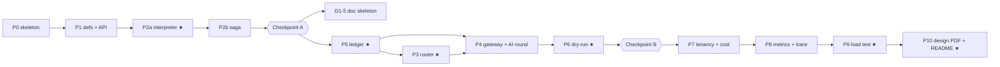

# 07 — Implementation Task List & Definition of Done

> Status: **v1 (2026-10-02)**. Derived from [06 v4](./06-execution-plan.md); 06 stays authoritative for design, hours and scope. This doc breaks 06 §6 into tasks you can tick off, says how they depend on each other, and gives each one a checklist that says when it's done.
> Budget: **16.0 h**. Each phase's task estimates add up to the phase hours in 06 §6.

---

## 0. How to use this doc

- **Task id** = `T<phase>.<n>` (e.g. `T2a.3`). Use it in commit subjects: `feat(engine): T2a.3 ready-set loop`.
- **A task is done** when every box in its own checklist **and** in the global checklist (§1) is ticked.
- **A phase is done** when all its tasks are done **and** its exit gate is green. Do not start the next phase with a red gate; apply the cut-list (§5) instead.
- **Tests first.** For every task with a test bullet, write the test, watch it fail, then implement (06 §6 mitigation for P2a).
- Track progress in the table in §6. Update `docs/ai-usage.md` whenever an AI suggestion is overridden.

---

## 1. Global definition of done (applies to every task)

- [ ] Tests named in the task are written first and pass; `./gradlew check` is green (unit + ArchUnit + Testcontainers)
- [ ] Every new SQL statement on a tenant-scoped table filters on `tenant_id` (06 §2 rule 2)
- [ ] Only `*.persistence` packages touch JDBC; only `OutboundClient` makes HTTP calls (06 §2 rule 3)
- [ ] Nothing inside `engine.workflow` uses Spring, JDBC, `Instant.now`, `Random` or `Thread` (ArchUnit enforces this)
- [ ] No secrets or credentials in code, config or fixtures; API keys stored only as hashes
- [ ] Errors map onto the taxonomy (`RetryableError` / `NonRetryableError(code)`); codes match the 06 §0 vocabulary
- [ ] Functions < 50 lines, files < 800 lines, no nesting deeper than 4 levels
- [ ] Conventional commit containing the task id; pushed at each checkpoint
- [ ] If a decision was made that 06 doesn't cover, it's recorded as one line in the README "Assumptions" draft

---

## 2. Workstreams (how the work is split)

| Lane | Packages / dirs | Phases | Never-cut? |
|---|---|---|---|
| **A. Platform** | `build.gradle`, `compose.yml`, `Dockerfile`, `common`, `mocks/` | P0 (+ mocks growing in P3–P5) | ✅ (foundation) |
| **B. Core engine** | `definition`, `api`, `engine`, `execution`, `nodes` (http, condition) | P1, P2a, P2b | P2a ✅ · P2b cut-list #4 |
| **C. Side effects** | `sideeffect`, `tools` (registry) | P5 | ✅ |
| **D. AI & tools** | `router`, `tools` (gateway), `nodes` (llm, mcp) | P3, P4 | router degradation ✅ · AI tool round cut-list #3 |
| **E. Dry-run** | `dryrun` | P6 | ✅ |
| **F. Tenancy & cost** | `tenancy`, `cost` | P7 | cut-list #2 |
| **G. Observability** | `observability`, `/trace` | P8 | cut-list #1 |
| **H. Proof & docs** | `loadtest/`, `scripts/`, `docs/` | D1·5, P9, P10 + one demo script per phase | load numbers + design PDF ✅ |

### Dependency graph

**Interface seams decided up front, so lanes can be stubbed without waiting on each other:**

| Seam | Owner | Consumers | Stub until |
|---|---|---|---|
| `NodeExecutor.execute(NodeContext) → NodeResult{outputRef, costUsd, tokens}` | B (P2a) | D, E | Llm/Mcp stubs return fixed output until P3/P4 |
| `SideEffectGuard.run(effectKey, attempt, mode, call)` | C (P5) | B (Http side-effecting), D (Mcp) | P2b saga tests use a pass-through guard |
| `LlmRouter.route(request, priority, tenant)` | D (P3) | `LlmExecutor` | — |
| `ToolGateway.invoke(tenant, tool, args, ctx)` | D (P4) | `McpToolExecutor`, LLM tool round | — |
| `BudgetService.try/confirm/cancel` | F (P7) | router, gateway | no-op implementation until P7 |
| `ExecutorRegistry.resolve(type, mode)` | B (P2a) | E (P6) | resolves LIVE only until P6 |

---

## 3. Phase task lists

### P0 — Skeleton · D1·1 · 1.5 h · lane A

| Id | Task | h | Depends |
|---|---|---|---|
| T0.1 | Gradle multi-project (`app`, `mocks`), Java 21, Spring Boot 3, Temporal Spring Boot starter, Flyway, Testcontainers, WireMock, ArchUnit, networknt json-schema, Micrometer Prometheus | 0.25 | — |
| T0.2 | `compose.yml` with profiles `lite` / `full` / `app`; multi-stage `Dockerfile`; healthchecks; `spring-boot-docker-compose` `start-only` for `bootRun`; explicit Temporal connection config | 0.40 | T0.1 |
| T0.3 | Flyway **V1** (06 §5): tenant, tenant_limits, api_key, workflow_definition, workflow_execution (+`deadline_at`, `row_version`, `UNIQUE(tenant_id, idempotency_key)`, partial index for the soft cap), node_run, node_output (+`call_index`); seed one dev tenant + hashed key | 0.25 | T0.2 |
| T0.4 | `common`: typed ids, `TenantContext` + MDC, error taxonomy → `ApplicationFailure`, Jackson config, injectable `Clock`, **`EffectKey`**, `OutboundClient` (timeout, `Idempotency-Key`, SSRF deny-list incl. own host, mode-aware allow-list) | 0.30 | T0.1 |
| T0.5 | `mocks` skeleton: health, `/admin/latency`, `/admin/fail-rate`, `/admin/reset`, `/admin/calls` | 0.15 | T0.1 |
| T0.6 | ArchUnit determinism rule (runs on an empty `engine.workflow` package); `docs/ai-usage.md` started | 0.05 | T0.1 |
| T0.7 | **Check the 6 Temporal unknowns** (06 §10) against the SDK/server versions you pinned; write the outcome + chosen fallback for each into `docs/ai-usage.md` § "Verified facts" | 0.10 | T0.2 |

**Task checklists**
- T0.4 — [ ] `EffectKey` test: stable across attempts, differs by phase and by `callIndex` · [ ] `OutboundClient` test: refuses `169.254.169.254`, `10.0.0.0/8` and the platform's own host; refuses a non-allow-listed host when mode ≠ `LIVE`; sends `Idempotency-Key`
- T0.7 — [ ] each of the 6 items marked *confirmed* or *fallback used*, with the version checked

**Exit gate P0**
- [ ] `./gradlew bootRun` from a clean checkout → `/actuator/health` UP, Flyway V1 applied, Temporal UI on `:8233`
- [ ] `docker compose --profile lite --profile app up` → app + mocks healthy with only Docker installed
- [ ] `./gradlew check` green (EffectKey, OutboundClient, ArchUnit)

---

### P1 — Definitions & API · D1·2 · 1.0 h · lane B

| Id | Task | h | Depends |
|---|---|---|---|
| T1.1 | `definition` model (`WorkflowDefinition`, `NodeSpec`, `limits`, `forEach`, `retry`, `compensate`, `side_effecting`) parsing the **PDF §4 JSON unchanged**; implicit list-order dependency; `depends_on: []` = root; `FrozenDefinition`; repository with `sha256` | 0.25 | P0 |
| T1.2 | Validator: every error and warning in 06 §4.3 (table-driven tests) | 0.30 | T1.1 |
| T1.3 | `api`: envelope `{data, error, meta}`; API-key filter (SHA-256 lookup → `TenantContext`); POST/GET definitions; POST executions (idempotency check **first** → INSERT `QUEUED` → Temporal start with 3 inline retries, already-started = success → `START_FAILED` + 503 `Retry-After`); GET execution; DELETE = cancel; cross-tenant → 404. The workflow is a **stub** that completes immediately until P2a | 0.45 | T1.1 |

**Task checklists**
- T1.2 — [ ] one test row per error: cycle, missing dependency, > 50 nodes, width/`maxConcurrency` > 100, unknown type/tool, condition that doesn't parse, timeout outside caps, `retry.maxAttempts` > 5, ScheduleToClose < StartToClose + lease grace, limits above tenant ceilings, `compensate` with no side effect · [ ] one test row per warning (compensatable after pivot, > 1 pivot per path, side-effecting without `compensate` or `pivot`)
- T1.3 — [ ] contract test: PDF example posted unchanged → 201, then execution → 202 · [ ] same `Idempotency-Key` twice → same `executionId`, one row · [ ] other tenant's id → 404 · [ ] Temporal start forced to fail → 503 + `Retry-After`, row = `START_FAILED`

**Exit gate P1:** [ ] validator + contract tests green · [ ] `curl` of the PDF example → 202 against `lite`

---

### P2a — Interpreter ★ · D1·3 · 4.0 h · lane B · **never-cut**

| Id | Task | h | Depends |
|---|---|---|---|
| T2a.1 | Test harness: `TestWorkflowEnvironment` (time-skipping) + Testcontainers Postgres + WireMock base class; **write all 10 P2a tests now (red)** | 0.75 | P1 |
| T2a.2 | `DagInterpreterWorkflow` core: ready set, `Async.function` up to `maxParallel` (default 16, cap 100), `Promise.anyOf` loop, implicit deps, `FAIL_FAST` vs `CONTINUE` (dependants SKIPPED), version pinned from `FrozenDefinition` | 1.00 | T2a.1 |
| T2a.3 | `NodeActivity` + `ExecutorRegistry` + `HttpExecutor` (WireMock error mapping: timeout/5xx → retryable, 4xx → non-retryable, 429 → retryable with `nextRetryDelay` from `Retry-After`) + **stub** `LlmExecutor` / `McpToolExecutor`; writes `node_run` + `node_output`, returns `NodeOutputRef` (≤ 2 KB inlined); per-node activity options (06 §4.4); side-effecting → `WAIT_CANCELLATION_COMPLETED` | 0.75 | T2a.2 |
| T2a.4 | Condition node evaluated in-workflow; untaken branch SKIPPED | 0.25 | T2a.2 |
| T2a.5 | `forEach`: items resolved from upstream output, > 100 → `FANOUT_LIMIT`, one activity per item with `callIndex = i`, `maxConcurrency`, output = array of refs | 0.50 | T2a.3 |
| T2a.6 | In-workflow deadline timer → `TIMED_OUT`; cancel via DELETE → `CANCELLED`; counters for node executions (500 → `NODE_EXEC_LIMIT`), cost (`BUDGET_EXCEEDED`), tokens (`TOKEN_BUDGET_EXCEEDED`); Temporal timeout = deadline + 1 h | 0.40 | T2a.2 |
| T2a.7 | `execution` CAS (`status = ANY(:allowedFrom)`, `row_version+1`) via local activity; `snapshot()` query; GET `/nodes`; `happy-path.sh` | 0.35 | T2a.2 |

**Task checklists (the 10 tests from 06 §4.4, + 2)**
- [ ] 1 sequential (PDF example) · [ ] 2 parallel diamond · [ ] 3 dependency order · [ ] 4 retry-then-succeed · [ ] 5 timeout · [ ] 6 fail-fast vs continue · [ ] 7 cancel mid-flight · [ ] 8 v3 run unaffected by a v4 publish · [ ] 9 condition skip · [ ] 10 `forEach` of 100 with `maxConcurrency` 16 (max 16 in flight, 100 `node_output` rows)
- [ ] CAS race: 10 threads → exactly one terminal state · [ ] Http error-mapping table test
- [ ] `scripts/happy-path.sh` runs green on `lite`; worker kill + restart mid-run resumes (manual demo, noted in README)

**Exit gate P2a:** [ ] 12 tests green · [ ] ArchUnit still green with real workflow code · [ ] happy-path demo green

---

### P2b — Linear saga · D1·4 · 0.75 h · lane B · cut-list #4

| Id | Task | h | Depends |
|---|---|---|---|
| T2b.1 | `Saga(continueWithError=true)`; `addCompensation` when a compensatable node succeeds; on fail/cancel/deadline: cancel the in-flight scope and **wait** for it, then reconcile-then-compensate every compensatable node with a ledger row (pass-through guard until P5); compensation + terminal CAS in `newDetachedCancellationScope`; statuses `COMPENSATING → COMPENSATED / COMPENSATION_FAILED` | 0.45 | P2a |
| T2b.2 | 3 tests + `saga-charge-then-send.sh` | 0.30 | T2b.1 |

**Checklist:** [ ] charge → send fails → exactly one refund · [ ] sibling fails while a charge is in flight → exactly one refund · [ ] terminal CAS never overwritten by a late projection

**🚩 Checkpoint A (end of D1):** [ ] P0–P2b gates green · [ ] commit + push · [ ] if P2a/P2b are still red: apply cut-list #4 now (P2b → design-only, keep `WAIT_CANCELLATION_COMPLETED`), don't carry it into D2

---

### D1·5 — Design-doc skeleton · 0.5 h · lane H · **never-cut**

| Id | Task | h |
|---|---|---|
| TD.1 | `docs/design.md` with the 5-page outline from 06 §8.1; each section filled with bullets pulled from 01/05; §9 seven-variation table drafted | 0.5 |

**Checklist:** [ ] all 13 PDF §14 topics have a heading and ≥ 3 bullets · [ ] pages 1–2 are close to final prose

---

### P5 — Side-effect ledger ★ · D2·1 · 1.5 h · lane C · **never-cut**

| Id | Task | h | Depends |
|---|---|---|---|
| T5.1 | Flyway **V2**: `tool_registry` (+ seed of the 6 tools with `reversibility` / `idempotency` / `compensation`), `side_effect_ledger` | 0.20 | CA |
| T5.2 | `SideEffectGuard.run` protocol from 06 §4.9: insert-or-read; COMMITTED → stored response; PENDING with a live lease → `EFFECT_IN_PROGRESS` + `nextRetryDelay = lease_until − now`; expired lease → CAS take ownership → reconcile by mode (NATIVE_KEY re-call · LOOKUP · NONE → UNKNOWN + `NEEDS_ATTENTION`); call outside any transaction; commit from PENDING/UNKNOWN; `lease_until = now + StartToClose + 5 s`. Wire into `HttpExecutor` for `side_effecting: true` | 0.60 | T5.1 |
| T5.3 | Mocks: payments `/charge` `/refund` with `Idempotency-Key` (409 while in flight, stored response once done); `/admin/rate-limit`, `/admin/drop-connection`; crm lookup | 0.20 | T5.1 |
| T5.4 | Compensation phase: same key scheme, phase `COMPENSATE`; reconcile forward first (COMMITTED → compensate · FAILED/absent → skip · UNKNOWN → LOOKUP else `NEEDS_ATTENTION`); executed pivot → `COMPENSATION_FAILED` + audit. Replace the P2b pass-through guard | 0.20 | T5.2 |
| T5.5 | 5 tests + `failure-walkthrough.sh` | 0.30 | T5.2–T5.4 |

**Checklist (06 §4.9):** [ ] 1 no double charge after a crash between call and commit · [ ] 2 PDF §9 NATIVE_KEY: API at 15 s, timeout 10 s → attempt 2 delayed to lease end → stored result → exactly one charge, SUCCEEDED · [ ] 3 PDF §9 NONE: no second call, `NEEDS_ATTENTION` · [ ] 4 refund always 500 → bounded retries → `COMPENSATION_FAILED` · [ ] 5 UNKNOWN forward effect gets no blind compensation · [ ] `failure-walkthrough.sh` covers 15 s/10 s (both modes), worker kill at 12 s, drop-connection, rate-limit with `Retry-After`

**Exit gate P5:** [ ] 5 tests green and stable across 5 runs (flake check, 06 §10) · [ ] `/admin/calls` shows exactly one charge in the walk-through

---

### P3 — LLM router ★ · D2·2 · 1.5 h · lane D · degradation is **never-cut**

| Id | Task | h | Depends |
|---|---|---|---|
| T3.1 | Flyway **V3** `llm_call`; provider config (A 200 ms / $0.010 / 100 RPS · B 500 ms / $0.004 / 500 RPS · vLLM 100 ms / $0.002 / 200 RPS); mocks `llm-a`, `llm-b`, `vllm` (OpenAI-shaped, can return a `tool_call`) | 0.30 | P5 |
| T3.2 | Pipeline: filter (capability, tenant allow-list, state ≠ OPEN, per-provider token bucket) → priority-weighted score (cost / p95 / errRate, DEGRADED penalty) → ≤ 2 fallbacks sharing the attempt budget → spill (vLLM empty: NORMAL/LOW → B, HIGH → A) | 0.50 | T3.1 |
| T3.3 | Health state machine (06 §4.7 table): 10 s windows, 6-window lookback, N = 20 minimum samples, deterministic 5 % probe on DEGRADED, injectable clock | 0.40 | T3.1 |
| T3.4 | Real `LlmExecutor` → router; one `llm_call` row per call (candidates, reason, tokens, cost, latency, outcome); cost + tokens fed back to the workflow counters | 0.15 | T3.2 |
| T3.5 | `vllm-degradation.sh` (≥ 5 req/s, flips vLLM latency to 3 s, shows switch + recovery) | 0.15 | T3.3 |

**Checklist:** [ ] scoring per priority · [ ] filter excludes OPEN / not allowed / no capability · [ ] degradation: p95 > 2 s for 2 windows → DEGRADED → traffic moves · [ ] DEGRADED → HEALTHY through probes · [ ] a window with < 20 samples changes nothing · [ ] bucket exhausted → spill to B (HIGH → A) · [ ] script output shows the router reason changing

---

### P4 — Tool gateway & AI tool round · D2·3 · 1.25 h · lane D

| Id | Task | h | Depends |
|---|---|---|---|
| T4.1 | Flyway **V4**: `tenant_tool_grant`, `tool_call_audit` (one row per attempt, args hashed) | 0.15 | P5 |
| T4.2 | Mocks: JSON-RPC 2.0 MCP endpoint `tools/list`, `tools/call` for the 6 seeded tools | 0.25 | T4.1 |
| T4.3 | `ToolGateway.invoke`: grant/scope (`TOOL_FORBIDDEN`) → JSON-schema validation (non-retryable) → `SideEffectGuard` for non-READ_ONLY tools → call via `OutboundClient` → audit; per-tenant credentials injected from env, never stored in definitions, prompts or `node_output` | 0.40 | T4.2 |
| T4.4 | Real `McpToolExecutor`; GET `/v1/tools` (tenant's granted tools) | 0.15 | T4.3 |
| T4.5 | LLM tool round: `tools: [...]`, `maxToolCalls` (default 1, cap 3 → `TOOL_CALL_LIMIT`), loop inside one activity, every LLM turn through the router; validator rejects non-READ_ONLY tools in an `llm` node's `tools` | 0.30 | T4.3, P3 |

**Checklist:** [ ] invalid args → non-retryable · [ ] missing scope → `TOOL_FORBIDDEN` · [ ] timeout retried · [ ] one audit row per attempt · [ ] `tools/call` round trip · [ ] AI round: mock LLM returns a `tool_call`, final output contains the tool result · [ ] 4th tool call → `TOOL_CALL_LIMIT` · [ ] grep test: no credential string in `node_output` / `llm_call`

---

### P6 — Dry-run ★ · D2·4 · 0.75 h · lane E · **never-cut**

| Id | Task | h | Depends |
|---|---|---|---|
| T6.1 | `ExecutorRegistry.resolve(type, mode)` applies the 06 §4.10 policy table (LLM live unless `mockLlm`; READ_ONLY tools and `side_effecting:false` http live unless `allowReadOnly=false`; everything else mocked, **unclassified http included**); mock executors from `dryRunExample` / output schema with a seed of `hash(workflowId, defVersion, nodeId, inputHash)`; `OutboundClient` blocks anything else in non-LIVE mode; lower `maxCostUsd` default for dry-runs | 0.35 | P4 |
| T6.2 | GET `/preview`: outputs, list of mocked calls, rendered compensation plan | 0.20 | T6.1 |
| T6.3 | 3 tests + `dry-run.sh` (PDF §7 lead workflow) | 0.20 | T6.2 |

**Checklist:** [ ] lead workflow: fetch + classify hit the mocks once each, CRM + send **zero** times · [ ] unclassified http POST node → zero real hits · [ ] two `mockLlm=true` dry-runs → byte-identical previews

**🚩 Checkpoint B:** [ ] P5, P3, P6 gates green · [ ] commit + push · [ ] work out how far behind schedule you are; **more than 1 h behind → apply cut-list items 1–3 in order** (§5) before starting P7

---

### P7 — Tenancy & cost · D2·5 · 0.75 h · lane F · cut-list #2

| Id | Task | h | Depends |
|---|---|---|---|
| T7.1 | In-memory per-tenant token bucket (after the idempotency check) → `429 RATE_LIMITED`; soft cap via the derived count → `429 CONCURRENCY_LIMIT`; both with `Retry-After` | 0.30 | CB |
| T7.2 | Flyway **V5** `tenant_budget`, `budget_reservation`; per-call TCC (`try` = conditional `UPDATE … RETURNING`, `confirm` from RESERVED **or CANCELLED**, `cancel`); wired into router + gateway, replacing the no-op | 0.35 | T7.1 |
| T7.3 | Temporal `Priority` builder (priority key from tenant tier; fairness key only if T0.7 confirmed it) | 0.10 | T7.1 |

**Checklist:** [ ] admission isolation: A at 10× its limit, B 100 % admitted, A's rejects are 429 + `Retry-After` · [ ] soft-cap overshoot ≤ number of concurrent admitters (race test) · [ ] 50 concurrent reservations vs budget for 10 → exactly 10 · [ ] runaway `forEach` stopped by the per-execution budget · [ ] late confirm after cancel records the spend

---

### P8 — Observability · D2·6 · 0.5 h · lane G · cut-list #1

| Id | Task | h | Depends |
|---|---|---|---|
| T8.1 | Micrometer: the 9 PDF metrics + `compensations_total{outcome}`, `router_decisions_total{provider,reason}`, `side_effect_unknown_total`; labels `tenant_tier, workflow_id, node_type, provider, model`; **no `tenant_id` label**; `queue_depth` from the source chosen in T0.7 + `count(QUEUED)` | 0.25 | P7 |
| T8.2 | GET `/trace`: timeline joined from `node_run` + `llm_call` + `tool_call_audit` (start/end, attempts, error, provider + router reason, tokens, cost) | 0.25 | P7 |

**Checklist:** [ ] test asserts the names and tags of the 9 metrics on `/actuator/prometheus` · [ ] test: `/trace` has node timings, router reason, tokens, cost, retries · [ ] sample `/trace` output saved for the design doc

---

### P9 — Load test ★ · D2·7 · 1.0 h · lane H · **never-cut**

| Id | Task | h | Depends |
|---|---|---|---|
| T9.1 | k6 scenario on `full` + `app`: 3 tenants (1 heavy, 2 light), lead workflow with `forEach` of 10, ramp to saturation | 0.40 | P8 |
| T9.2 | `loadtest/capture.sh`: k6 summary, `docker stats` sampling, `pg_stat_database` / `pg_stat_statements` deltas for **both** DBs, Prometheus queries for `queue_depth` + schedule-to-start | 0.30 | T9.1 |
| T9.3 | Run it, write `loadtest/RESULTS.md`: throughput, p50/p95/p99, CPU/mem, DB load, queue depth, first bottleneck, writes per execution, extrapolation to 500/s, 10× plan | 0.30 | T9.2 |

**Checklist:** [ ] `docker compose --profile full --profile app up` + one command reproduces the run · [ ] every PDF §15 item has a number or a stated reason it's missing · [ ] bottleneck named with evidence (which metric showed it)

---

### P10 — Design PDF, diagram, README ★ · D2·8 · 1.0 h · lane H · **never-cut**

| Id | Task | h | Depends |
|---|---|---|---|
| T10.1 | Finish `docs/design.md` (06 §8.1 page budget), render `docs/design.pdf`, check it is ≤ 5 pages | 0.50 | P9 |
| T10.2 | `docs/architecture.svg` | 0.15 | — |
| T10.3 | README: one-command run, dev path, demo scripts, assumptions (implicit ordering, rejecting admission, Run Again = new effects, …), AI-tool usage **incl. overrides** (from `docs/ai-usage.md`), cut + stretch items with their design-doc sections, JaCoCo summary, "with more time" | 0.20 | T10.1 |
| T10.4 | Release check: record 2 histories after P5 and add the 2 `WorkflowReplayer` tests (06 §7); fresh-clone run of the release DoD (§4) | 0.15 | all |

---

## 4. Release definition of done (06 §9, expanded)

**Runs**
- [ ] Fresh clone + Docker only: `docker compose --profile lite --profile app up` → all healthy; `happy-path.sh` green
- [ ] `./gradlew bootRun` dev path documented and working
- [ ] `docker compose --profile full --profile app up` + `loadtest/` command reproduces `RESULTS.md`

**Never-cut items green**
- [ ] P2a: 10 engine tests + CAS race
- [ ] P5: 5 ledger tests + `failure-walkthrough.sh`
- [ ] P3: degradation + spill tests + `vllm-degradation.sh`
- [ ] P6: 3 dry-run tests + `dry-run.sh`
- [ ] P9: `RESULTS.md` with numbers
- [ ] P10: `docs/design.pdf` ≤ 5 pages, all 13 PDF §14 topics

**Proof per PDF section** (cross-check against 06 §1): [ ] every ✅ row has a passing test or script · [ ] every 🟡 / 📄 row has a design-doc section, linked from the README

**Hygiene**
- [ ] No secrets in the repo (`git grep` for key patterns); keys stored hashed
- [ ] `tenant_id` on every table and in every tenant-scoped query
- [ ] `./gradlew check` green; JaCoCo report generated and its numbers in the README (no gate, 06 §7)
- [ ] 2 replay tests green (determinism of the interpreter against recorded histories)
- [ ] Every cut and every stretch item listed in the README with its design-doc section

---

## 5. Cut-list & stretch (from 06 §6, as decisions)

| When | Do this | What survives |
|---|---|---|
| Checkpoint A red | Cut #4: P2b → design-only | `WAIT_CANCELLATION_COMPLETED` kept |
| Checkpoint B > 1 h behind | Cut #1: P8 → metrics only, `/trace` = raw `node_run` | Prometheus endpoint |
| still behind | Cut #2: P7 → per-execution caps only | Workflow counters (P2a) |
| still behind | Cut #3: AI round → fixed-tool variant (`maxToolCalls=1`) | LLM consumes a tool result |
| Ahead after P10 | Stretch in order: Grafana dashboard → approval node → `REPLAY` → OTel/Jaeger → Redis limiter / fairness / reaper / `resource_lease` | — |

Each cut = one README line + its design-doc section, committed as `docs: cut <item>`.

---

## 6. Progress tracker

| Phase | Block | h | Status | Gate | Notes |
|---|---|---|---|---|---|
| P0 | D1·1 | 1.50 | ✅ | ✅ | 47 tests green; Temporal unknowns 1–5 confirmed, 6 fallback (server + admin-tools) |
| P1 | D1·2 | 1.00 | ☐ | ☐ | |
| P2a ★ | D1·3 | 4.00 | ☐ | ☐ | |
| P2b | D1·4 | 0.75 | ☐ | ☐ Checkpoint A | |
| Doc skeleton ★ | D1·5 | 0.50 | ✅ | ✅ | `docs/design.md` drafted (≈3.6 k words, trim ~600 in P10) |
| P5 ★ | D2·1 | 1.50 | 🟡 | ☐ | T5.1/T5.2/T5.4 guard-level + mocks T5.3 done (ledger ITs green); engine-level §9 tests + walkthrough wait on P2a |
| P3 ★ | D2·2 | 1.50 | ☐ | ☐ | |
| P4 | D2·3 | 1.25 | ☐ | ☐ | |
| P6 ★ | D2·4 | 0.75 | ☐ | ☐ Checkpoint B | |
| P7 | D2·5 | 0.75 | ☐ | ☐ | |
| P8 | D2·6 | 0.50 | ☐ | ☐ | |
| P9 ★ | D2·7 | 1.00 | ☐ | ☐ | |
| P10 ★ | D2·8 | 1.00 | ☐ | ☐ Release DoD | |
| **Total** | | **16.00** | | | |

---

## 7. Gaps in 06 that this breakdown fills

| # | Gap in 06 | Where it lands here |
|---|---|---|
| 1 | The 5 demo scripts (06 §8) had no slot in the schedule | One per phase: happy-path T2a.7 · saga T2b.2 · failure-walkthrough T5.5 · vLLM T3.5 · dry-run T6.3 |
| 2 | The 2 replay tests (06 §7) had no slot | T10.4 |
| 3 | P1 starts executions before the workflow exists | P1 uses a stub workflow that completes immediately; P2a replaces it |
| 4 | P5 is scheduled before the P4 gateway, but its tests need a side-effecting caller | The guard is wired into `HttpExecutor` (`side_effecting: true`) in T5.2; the gateway reuses it in T4.3 |
| 5 | Router/gateway depend on `cost`, which isn't built until P7 | No-op `BudgetService` seam until T7.2; cost/tokens still flow to the workflow counters from T3.4 |
| 6 | P2b compensation needs the ledger, which isn't built until P5 | Pass-through guard in P2b; T5.4 swaps in reconcile-then-compensate |
| 7 | Mock admin endpoints `/rate-limit` and `/drop-connection` had no phase | T5.3 |
| 8 | No flake check for the §9 timing tests (06 §10 risk) | P5 exit gate: 5 consecutive green runs |
