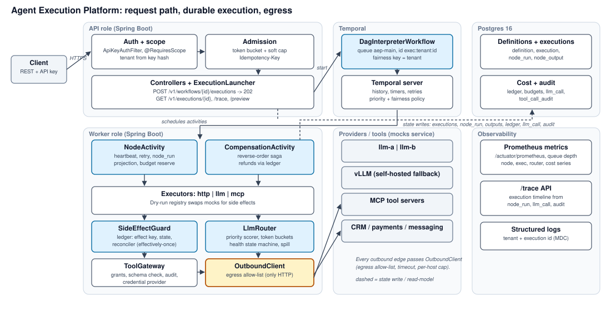
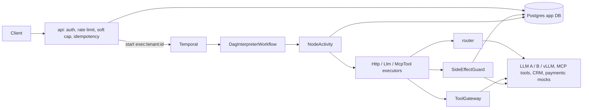

# Design Document: Agent Execution Platform

Java 21 / Spring Boot 3 / Temporal / Postgres. Status key: ✅ built and demonstrated · 🟡 built slice, rest designed · 📄 design only. Source of truth for scope: `docs/06-execution-plan.md`. Page budget: 5 A4 pages (sections 1-2 = p1, 3 = p2, 4-6 = p3, 7-10 = p4, 11-13 = p5).

<!-- PAGE 1 -->

## 1. High-level architecture ✅

One deployable Spring Boot app (`api`, `worker` roles by profile) plus a `mocks` service; Temporal provides durable execution; Postgres holds queryable state. Diagram below (`docs/architecture.svg`); a Mermaid fallback follows.

- **Temporal owns orchestration progress** (what completed, timers, retries, cancellation). **Postgres owns business state** (status, outputs, ledger, audit, cost), projected by activities. Neither is derived from the other at read time.
- **Enforced boundaries:** ArchUnit rule keeps `engine.workflow` free of Spring, JDBC, `Instant.now`, `Random`, `Thread`. `common.http.OutboundClient` is the only egress. Only `*.persistence` packages touch JDBC.
- **Tenant is a key, not a resource.** 10,000 tenants rule out per-tenant namespaces or queues; every table and query carries `tenant_id`.
- **Asynchronous API:** `POST /v1/workflows/{id}/executions` returns `202 {executionId}`; clients poll `GET /v1/executions/{id}` or `/trace`.
- **Alternatives considered** (section 13): custom Postgres engine, DBOS, Conductor, Restate.

## 2. Workflow execution model ✅

- **One generic workflow type, `DagInterpreterWorkflow`, runs every customer DAG.** Input is the *frozen* definition, so a later publish of v4 never changes a running v3, and replay is deterministic.
- **Definition** accepts the assignment's JSON verbatim (`workflow_id`, `version`, `nodes[{id,type,config}]`). Assumption: a node without `depends_on` depends on the previous node in list order; `depends_on: []` is an explicit root.
- **Loop:** compute the ready set; run up to `maxParallel` (default 16, cap 100) activities with `Async.function`; wake on `Promise.anyOf`; repeat. Condition nodes evaluate in-workflow (pure) and mark untaken branches SKIPPED.
- **`forEach`** is the answer to "fan-out 100 in a ≤ 50-node DAG": items resolved at runtime from upstream output, one activity per item (`callIndex = i`), `maxConcurrency` bounded, more than 100 items fails `FANOUT_LIMIT`.
- **Failure policy per node:** `FAIL_WORKFLOW` cancels siblings, waits for them to settle, then compensates; `CONTINUE` marks the node failed and SKIPs its dependants.
- **Per-node activity options:** StartToClose = node timeout; ScheduleToClose = timeout × (attempts + 1) + backoff; heartbeat 5 s on long nodes; side-effecting nodes use `WAIT_CANCELLATION_COMPLETED`.
- **Payloads stay out of history:** activities write `node_output` and return a `NodeOutputRef`; outputs < 2 KB are inlined for conditions. 500 node executions per execution (default) bounds history to ~3k events, far under Temporal's 10k warning.
- **Cancellation:** `DELETE /v1/executions/{id}` cancels the scope; the deadline is an in-workflow timer (Temporal's own timeout is +1 h as backstop).
- **Versioning:** definition versions are immutable `(tenant, workflow, def_version)` rows pinned at start; engine-code changes use `Workflow.getVersion` (procedure documented, not needed in v1).
- **Approval node** 📄: signal plus timer, default on timeout fails the branch. **Custom operators:** register a `NodeExecutor`.

## 3. Data model ✅

All tables carry `tenant_id`. Migrations: V1 core, V2 tools+ledger, V3 llm_call, V4 grants+audit, V5 budget.

| Table | Key | Purpose |
|---|---|---|
| `workflow_definition` | (tenant, workflow, def_version) | immutable spec JSONB + sha256 |
| `workflow_execution` | id; UNIQUE(tenant, idempotency_key) | status, `row_version`, mode, `deadline_at`, `source_execution_id` (Run Again lineage) |
| `node_run` | (execution, node, call_index, phase, attempt) | one row per attempt; `phase` FORWARD / COMPENSATE; error code, timings |
| `node_output` | (execution, node, call_index, attempt) | payload JSONB + sha256; passed by reference |
| `side_effect_ledger` | `effect_key` | state, `owner_attempt`, `lease_until`, `external_ref`, `response_ref` |
| `tool_registry`, `tenant_tool_grant`, `tool_call_audit` | tool; (tenant, tool); one row per attempt | schema, scopes, reversibility, idempotency mode; args hashed |
| `llm_call` | id | candidates, router reason, tokens, cost, latency, outcome |
| `tenant`, `tenant_limits`, `api_key`, `tenant_budget`, `budget_reservation` | | admission, SHA-256 key hash, TCC |

- **`EffectKey = sha256(tenant : exec : node : phase : callIndex)`**, computed in exactly one place; attempt number is deliberately excluded so every retry maps to the same ledger row.
- **Retention:** `node_output` must outlive the execution (compensation args are read from it). Prod: month-partition `node_run`, `llm_call`, `tool_call_audit` 📄.

## 4. State management ✅

- **Execution status** `QUEUED → RUNNING → {SUCCEEDED · FAILED · CANCELLED · TIMED_OUT · COMPENSATING → COMPENSATED · COMPENSATION_FAILED · NEEDS_ATTENTION}`, plus `START_FAILED` for admission. Node status per phase: `PENDING → RUNNING → {SUCCEEDED · FAILED · SKIPPED · CANCELLED · NEEDS_ATTENTION}`. Ledger: `PENDING · COMMITTED · UNKNOWN · FAILED`.
- **Single-writer transitions by compare-and-set:** `UPDATE … SET status=:to, row_version=row_version+1 WHERE id=:id AND status = ANY(:allowedFrom)`. Zero rows is an idempotent no-op, so a terminal state is never overwritten (tested with a 10-thread race). Isolation is READ COMMITTED, which re-evaluates `WHERE` on a locked row.
- **No external call inside a DB transaction, ever.** Transaction boundaries on a side effect: (a) ledger PENDING insert, (b) external call, outside any tx, (c) ledger COMMITTED + `node_output`, (d) Temporal activity completion. A crash between (b) and (c) is the assignment's §8 scenario.
- **Per-execution counters** (node executions, cost, tokens) live in workflow state; the workflow is their only writer, so no lock. Tenant-shared state (budget) uses TCC (section 7).
- **Secrets** are resolved inside activities and never enter workflow input, history, prompts or `node_output`.

<!-- PAGE 2 -->

## 5. Failure and retry semantics ✅/🟡

**Guarantee.** Activities are *at-least-once*: a crash between "the external system committed" and "we recorded it" is indistinguishable from "the request never arrived", so exactly-once across external systems is impossible. We provide **at-least-once execution + stable idempotency keys + a side-effect ledger = effectively-once side effects**, with an explicit `UNKNOWN` state that is never blindly retried. We do not claim exactly-once, and "rollback" is semantic compensation (ACD, not ACID): a refund is a new fact, not an erased charge.

**Error taxonomy.** `RetryableError` (timeout, 5xx, 429 with `Retry-After` as `nextRetryDelay`) vs `NonRetryableError(code)` (4xx, validation, `FANOUT_LIMIT`, budget codes). Retries use exponential backoff with jitter, `maxAttempts` ≤ 5 enforced by the validator.

**Timing contract for a side-effecting call** (StartToClose 10 s): `httpTimeout = StartToClose − 1 s = 9 s`, so our client gives up before Temporal times the attempt out; `lease_until = now + StartToClose + 5 s = 15 s`. The API may still succeed server-side after we gave up, so that success is learned only by *reconciliation*, never from the original attempt.

**`SideEffectGuard.run(effectKey, attempt, call)`:** (1) `INSERT … ON CONFLICT DO NOTHING`, read the row. COMMITTED returns the stored response. PENDING with a live lease throws retryable `EFFECT_IN_PROGRESS` with `nextRetryDelay = lease_until − now`, so the retry lands *after* the lease instead of burning attempts. PENDING with an expired lease: CAS-take ownership on `owner_attempt`, then reconcile by tool idempotency mode, **NATIVE_KEY** (re-send same key; provider returns the original result), **LOOKUP** (query by business key), **NONE** (mark UNKNOWN, node `NEEDS_ATTENTION`, no second call). (2) Make the call. (3) Commit from PENDING or UNKNOWN.

**Assignment §9: Node 4 calls an API that needs 15 s; node timeout is 10 s.**

| Variation | Mechanism (NATIVE_KEY / LOOKUP / NONE where it differs) | Status |
|---|---|---|
| 15 s API vs 10 s timeout | Attempt 1 aborts at 9 s (`httpTimeout`), fails at 10 s. Attempt 2 sees PENDING with live lease → `EFFECT_IN_PROGRESS`, `nextRetryDelay` = time to 15 s. Lease expired → NATIVE_KEY re-call returns stored result (one charge, SUCCEEDED); LOOKUP finds it by business key; **NONE** makes no call, `NEEDS_ATTENTION`, Node 5 waits, parallel branches unaffected | ✅ tests 2, 3 |
| Worker crash at 12 s | Heartbeat/StartToClose expires, Temporal reschedules on another worker; the workflow's state is in history. Same ledger path: PENDING with a lease up to 15 s → wait, then reconcile | ✅ crash test, scripted `lite` kill |
| Network loss | Activity cannot report completion, attempt times out. Same path; the response is recovered via re-call (NATIVE_KEY) or lookup, never assumed | ✅ `/admin/drop-connection` |
| Resume after 30 min | Replay from history; completed nodes are not re-run (their outputs are in `node_output`). Deadline timer and budgets still apply. Compensations past `valid_for_s` escalate | 📄 |
| Customer clicks Run Again | New POST, new `Idempotency-Key`, new `execution_id`, so new EffectKeys: new effects *by design*. Optional `business_key` dedupe (e.g. charge order #123 once) | 📄 |
| New version deployed mid-run | In-flight run keeps its frozen v3; new executions pin v4. Interpreter code changes go through `getVersion` | ✅ test |
| Rate-limited API (429) | Retryable with `Retry-After` as `nextRetryDelay`; counts toward `maxAttempts` (≤ 5) so it cannot loop forever; per-provider buckets stop us hitting the limit in the first place | ✅ script |

**Saga / compensation 🟡.** Registry declares reversibility (`COMPENSATABLE · PIVOT · RETRIABLE · READ_ONLY`); the safe shape is `compensatable* → pivot → retriable*` (validator warns otherwise). On `FAIL_WORKFLOW`, cancel or deadline: cancel the in-flight scope and **wait** for it to settle, then reconcile-then-compensate every compensatable node that has a ledger row, in reverse completion order (always a valid reverse topological order), inside a detached cancellation scope. An UNKNOWN forward effect is never compensated blindly; an executed pivot ends in `COMPENSATION_FAILED` plus audit. Diamond/parallel compensation ordering is design-only (`setParallelCompensation` is rejected as it ignores dependencies).

<!-- PAGE 3 -->

## 6. Scaling strategy 🟡

**Capacity math (assignment §3):**

| Quantity | Figure |
|---|---|
| Average load | 1 M exec/day ≈ 12 exec/s, trivial; peak sizes the system |
| Peak | 500 exec/s × 5–50 nodes = **2.5 k–25 k node executions/s** |
| Temporal history events | ~6 per activity → 15 k–150 k events/s |
| Orchestration-store writes | ≈ 50 k–150 k/s worst case, plus app-DB projection (`node_run`, `node_output`, ledger ≈ 3–4 rows per node) |
| Availability | 99.95 % ≈ 22 min/month: HA Temporal + HA Postgres; API accepts work if workers lag |

- **First bottleneck: persistence write throughput of Temporal on Postgres**, not CPU. The prototype uses Postgres; one primary will not carry 25 k activities/s (third-party benchmarks: ~4.5 k state transitions/s at 2,048 shards). We measure the actual limit with k6 and report it below.
- **10× plan:** Temporal Cloud or Cassandra-backed Temporal with 4 k+ history shards (fixed at cluster creation) and Elasticsearch visibility; split task queues/namespaces by tier; local activities for cheap nodes; pgbouncer. App DB: month-partition `node_run`/`llm_call`/audit, hash-shard by `tenant_id`, batch the projection writes, move hot tenant budget to sharded sub-counters or Redis.
- **Stateless workers** scale horizontally; `api` and `worker` roles scale independently. Activities are idempotent so any worker may take any task.
- **Fan-out:** 500 node executions per execution bounds history; a child workflow per `forEach` is the documented route beyond that.
- **Load-test results** (k6 on `full`, one heavy + two light tenants, lead workflow with `forEach` of 10):

<!-- RESULTS -->

## 7. Multi-tenancy and cost controls 🟡

- **Isolation:** tenant derived from the API key (SHA-256 hash lookup), another tenant's resource returns 404, every query filters `tenant_id`, metrics carry `tenant_tier` not `tenant_id` (10 k tenants would blow up cardinality).
- **Admission (built):** idempotency check first (a retried POST consumes no token, slot or budget) → per-tenant token bucket (`429 RATE_LIMITED` + `Retry-After`) → soft concurrency cap (`429 CONCURRENCY_LIMIT`). The cap is a derived count, `count(*) WHERE tenant_id=? AND status IN ('QUEUED','RUNNING') AND deadline_at > now()`, with no lock; overshoot is bounded by the number of concurrent admitters and tested. A row lock was rejected: it would serialise a busy tenant at a few hundred admissions/s.
- **Temporal Priority and Fairness** (fairness key = tenant, weight = tier) gives approximate dispatch fairness. It is not a quota and degrades with 10 k keys, so quotas and caps stay in our layer. Claimed only if verified on `full`.
- **"Tenant A submits 100,000 executions" 📄.** Production design: accept up to a backlog cap (e.g. 10 k) into `execution_queue` (202), reject the rest with 429; a dispatcher drains it with **deficit round-robin** over per-tenant backlogs (`FOR UPDATE SKIP LOCKED`, weighted by tier) up to A's concurrency cap, so B and C get their share every round and A's backlog is visible as `queue_depth{tenant_tier}`. The **prototype implements the rejecting variant** (429 + `Retry-After`), which pushes back on the client instead of storing the burst; the README states this.
- **Test ("admission isolation"):** A floods at 10× its limit; B's admissions all succeed; A's rejects are 429 with `Retry-After`.
- **Budgets, TCC:** per LLM/tool call `try` (conditional `UPDATE … WHERE spent+reserved+est ≤ limit RETURNING`) → `confirm` (from RESERVED or CANCELLED, so a late confirm after cancel still records spend) → `cancel`. 50 concurrent reservations against a budget for 10 yield exactly 10.

**Limit × enforcement layer (assignment §11):**

| Limit | Layer | Code on breach |
|---|---|---|
| Max cost | activity TCC reservation + workflow counter | `BUDGET_EXCEEDED` |
| Max tokens | workflow counter (fed by activity results) | `TOKEN_BUDGET_EXCEEDED` |
| Max time | in-workflow deadline timer (+1 h Temporal backstop) | `TIMED_OUT` |
| Max node executions | workflow counter, default 500 | `NODE_EXEC_LIMIT` |
| Max retries | validator cap `maxAttempts` ≤ 5 | validation error |
| Max fan-out | validator (static ≤ 100) + runtime `forEach` check | `FANOUT_LIMIT` |
| Tool rounds | `maxToolCalls` ≤ 3 in the `llm` node | `TOOL_CALL_LIMIT` |

Unbounded-loop sources are named and closed: fan-out, retries, the agent tool loop, and self-triggering (the SSRF deny-list blocks the platform's own host). Dry-run executions get a lower default `maxCostUsd`.

<!-- PAGE 4 -->

## 8. AI / LLM routing ✅

- **Pipeline:** filter (capability, tenant allow-list, state ≠ OPEN, per-provider token bucket) → score `cost / p95 / errRate` with weights by priority (HIGH latency-heavy, NORMAL balanced, LOW cost-heavy; DEGRADED adds a penalty) → fallback to at most 2 more providers, sharing the node's attempt budget. Every decision is persisted in `llm_call.candidates` and `reason`.
- **Providers (assignment §5):** A 200 ms / $0.010 / 100 RPS · B 500 ms / $0.004 / 500 RPS · vLLM 100 ms / $0.002 / 200 RPS. **Spill:** when vLLM's bucket is empty, NORMAL/LOW go to B and HIGH goes to A.
- **Health state machine** (10 s windows, 6-window lookback; windows with < 20 samples are ignored so an idle provider cannot flap):

| From | To | Condition |
|---|---|---|
| HEALTHY | DEGRADED | p95 > 2 s in 2 consecutive qualifying windows (detection ≈ 20 s) |
| any | OPEN | error rate > 50 % or p95 > 5 s in a qualifying window |
| OPEN | HALF_OPEN | after 30 s |
| HALF_OPEN | HEALTHY / OPEN | after 10 probe calls, by outcome |
| DEGRADED | HEALTHY | p95 ≤ 1.5 s in 3 consecutive qualifying windows (hysteresis) |
| DEGRADED | n/a | always gets a deterministic 5 % probe share (every 20th eligible request), which is what makes recovery observable |

- **vLLM p95 > 2 s scenario:** traffic shifts to B/A within ~20 s, vLLM keeps 5 % probes, and returns after 3 clean windows. Demo: `vllm-degradation.sh`, mock `/admin/latency`.
- **Router state is in-memory per instance** in the prototype; sharing windows and buckets across instances (Redis) is 📄.

## 9. MCP and tool execution ✅

- **Registry:** each tool has JSON input/output schema, scopes, timeout, retry, `reversibility`, `idempotency` (NATIVE_KEY / LOOKUP / NONE), compensation. Discovery: `GET /v1/tools`; transport to the `mocks` service is **JSON-RPC 2.0 `tools/list` + `tools/call`** through `OutboundClient`. The registry can tighten what an untrusted server declares, never loosen it.
- **`ToolGateway.invoke` order:** grant and scope check → JSON-schema validation (non-retryable on failure) → `SideEffectGuard` (side-effecting only) → call → audit. One `tool_call_audit` row per attempt, args hashed.
- **AI-selected tools:** an `llm` node with `tools: [...]` runs a bounded round inside one activity (LLM → `tool_call` → gateway → LLM with result), default 1 call, cap 3. **Only READ_ONLY tools may be AI-selected**; side-effecting tools stay fixed `mcp` nodes so the saga and ledger see every effect. The validator rejects anything else.
- **AuthN/Z boundary:** per-tenant tool credentials live in the gateway and are injected per call; they never appear in definitions, prompts or `node_output`. Agents propose, the platform executes.
- **Failures:** transport/5xx retryable; 4xx/validation non-retryable; missing scope `TOOL_FORBIDDEN`; timeout retried, behind the ledger when side-effecting.

## 10. Dry-run and replay ✅/📄

| Node | Default in `DRY_RUN` | Override |
|---|---|---|
| `llm` | live (budgeted, tagged `mode=DRY_RUN`) | `dryRun.mockLlm=true` |
| tool with `reversibility=READ_ONLY` | live | `dryRun.allowReadOnly=false` |
| `http` declared `side_effecting:false` | live | `allowReadOnly=false` |
| everything else: side-effecting, compensations, **unclassified http** | **mocked** | none |

- **Deny by default:** a node is live only if positively classified read-only; `OutboundClient` also refuses non-allow-listed hosts when mode ≠ LIVE, so an unflagged POST cannot leak through. This matches the assignment's example (Fetch Leads and LLM live; CRM Update and Send Message mocked).
- **Code reuse:** same interpreter, activities, templating, validation, router, budgets; only `ExecutorRegistry.resolve(type, mode)` differs. Mock outputs come from the tool's `dryRunExample` / output schema, seeded `hash(workflowId, defVersion, nodeId, inputHash)`.
- **Preview** (`GET /v1/executions/{id}/preview`): outputs, the list of mocked calls with rendered requests, and the compensation plan.
- **Determinism:** with `mockLlm=true` the same workflow and input give an identical preview (tested). With live LLMs it does not, by nature. **`REPLAY` mode 📄** (stretch): serve recorded `node_output` / `llm_call` keyed by `(node, requestHash)`, with Temporal's `WorkflowReplayer` covering orchestration determinism.

## 11. Observability ✅

- **Nine required metrics** (Micrometer → `/actuator/prometheus`): workflow latency histogram, executions by status (success rate), node latency, `llm_latency_seconds`, `llm_tokens_total{direction}`, `llm_cost_usd_total`, `node_retries_total`, `queue_depth`, `provider_errors_total`. Plus `compensations_total{outcome}`, `router_decisions_total{provider,reason}`, `side_effect_unknown_total`.
- **Labels:** `tenant_tier`, `workflow_id`, `node_type`, `provider`, `model`; **never `tenant_id`**. Per-tenant questions go to `/trace` and SQL on `node_run` / `llm_call`.
- **`queue_depth`** = Temporal schedule-to-start latency (+ `DescribeTaskQueue` backlog if supported) + `count(QUEUED)` at admission.
- **End-to-end trace (assignment §12 "or equivalent"):** `GET /v1/executions/{id}/trace` joins `node_run`, `llm_call`, `tool_call_audit` into a timeline: per node start/end, attempts, error code, provider and router reason, tokens, cost. It answers the four operator questions (why did it fail, why this provider, what did it cost, where is it stuck). OTel → Jaeger is stretch.

<!-- TRACE SAMPLE -->

<!-- PAGE 5 -->

## 12. Security 🟡

- **SSRF:** `OutboundClient` denies private ranges, metadata IPs and the platform's own API host (self-trigger loops); only allow-listed mock hosts bypass it. Per-tenant allow-list 📄.
- **Tenant scoping:** tenant from API key, `tenant_id` in every predicate (including `node_run`, `node_output`), cross-tenant access returns 404; Postgres row-level security as defence in depth 📄.
- **Keys and secrets:** `api_key(key_hash PK, tenant_id, scopes)` stores SHA-256 only; no secrets in code, config, fixtures, history or logs; tool credentials held by the gateway.
- **Prompt injection via tool output:** tool results are data, not instructions. Containment is structural: AI may only call READ_ONLY tools on the node's allow-list, args are schema-validated and scope-checked, the call count is capped, and side-effecting tools are unreachable from an LLM. Pivot calls proposed by agents would be staged and policy-checked 📄.
- **Injection and eval:** templates are non-executable (no SpEL); condition expressions use a sandboxed evaluator; error envelopes never leak internals; audit rows redact args.

## 13. Trade-offs, alternatives and what we'd do with more time

| Decision | Chosen | Alternative | Why |
|---|---|---|---|
| Orchestrator | **Temporal**, one generic interpreter workflow | Custom Postgres engine; DBOS Java; Conductor; Restate; Step Functions | Durable timers, retries, heartbeats, cancellation, replay come free; a custom engine rebuilds exactly where bugs hide, with the same single-writer ceiling. DBOS is the Postgres-only runner-up (≤ ~5k steps/s); Conductor wins for a user-editable server-side DSL. Hatchet has no Java SDK; Restate has no Postgres and BSL licensing |
| Workflow granularity | One workflow per execution | Child workflow per node | Small history at ≤ 50 nodes; children only beyond `forEach` scale |
| Admission over cap | Reject with 429 | DRR backlog | Pushes back on the client, avoids storing bursts; DRR is the production answer (section 7) |
| Concurrency cap | Derived count, soft | Row lock / counter | A lock serialises a busy tenant; a counter leaks on abnormal termination |
| Exactly-once | At-least-once + ledger | Claim exactly-once / 2PC | External APIs cannot join 2PC; claiming it would be false |
| Trace | `/trace` from Postgres | OTel + Jaeger first | Meets the assignment's "equivalent"; answers per-tenant questions that metrics cannot |
| Payloads | By reference in Postgres | Inline in history | 2 MB payload and 50 k-event limits |
| LLM layer | Thin `LlmProvider` + own router | LangChain4j | The router logic is the deliverable |
| Rate limiter | In-memory per instance | Redis | Prototype; Redis needed for multi-instance correctness |

**With more time:** (1) `REPLAY` mode and diamond-aware parallel compensation; (2) approval node (signal + timer); (3) DRR dispatcher and daily quotas; (4) Redis for limiter and router health, per tenant × provider buckets; (5) OTel → Jaeger and a Grafana dashboard; (6) Temporal fairness verified at 10 k keys; (7) row-level security, per-tenant egress allow-lists; (8) `EFFECT_KEY_CONFLICT` request-hash check and crash-during-compensation tests; (9) month-partitioned audit tables and a budget reaper; (10) resource leases with fencing tokens for two agents mutating one CRM record.
