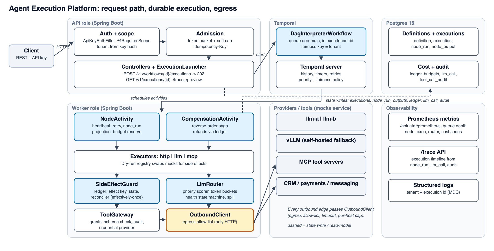

**Agent Execution Platform: Design Document**

Java 21, Spring Boot 3, Temporal, Postgres 16. Status tags: **[B]** built and demonstrated, **[P]** built slice, rest designed, **[D]** design only. Scope source of truth: `docs/06-execution-plan.md`; deviations: `docs/ai-usage.md`.

## 1. High-level architecture [B]

One Spring Boot app (`api` and `worker` roles by profile) plus a `mocks` service (LLMs, vLLM, CRM, payments, MCP tools). Temporal provides durable execution; Postgres holds queryable state. Source: `docs/architecture.svg`.

{width=92%}

- **Temporal owns orchestration progress** (what completed, timers, retries, cancellation); **Postgres owns business state** (status, outputs, ledger, audit, cost), projected by activities.
- **Enforced boundaries:** an ArchUnit rule keeps `engine.workflow` free of Spring, JDBC, `Instant.now`, `Random`, `Thread`. `common.http.OutboundClient` is the only egress; JDBC lives only in `*.persistence` packages.
- **Tenant is a key, not a resource:** 10,000 tenants rule out per-tenant namespaces or queues. The API is asynchronous: `POST .../executions` returns `202 {executionId}`.

## 2. Workflow execution model [B]

- **One generic `DagInterpreterWorkflow` runs every customer DAG.** Its input is the *frozen* definition, so publishing v4 never changes a running v3 and replay stays deterministic. Replay is tested (`WorkflowReplayIT`, two committed histories).
- **Definition** accepts the assignment JSON verbatim. Assumption: a node without `depends_on` depends on the previous node in list order; `depends_on: []` is an explicit root.
- **Loop:** compute the ready set, run up to `maxParallel` (default 16, cap 100) activities with `Async.function`, wake on `Promise.anyOf`, repeat. Condition nodes evaluate in-workflow and mark untaken branches SKIPPED.
- **`forEach`** answers "fan-out 100 in a 50-node DAG": items come from upstream output, one activity per item (`callIndex = i`), `maxConcurrency` bounded, more than 100 items fails `FANOUT_LIMIT`.
- **Failure policy per node:** `FAIL_WORKFLOW` cancels siblings, waits for them to settle, then compensates; `CONTINUE` marks the node failed and skips its dependants.
- **Payloads stay out of history:** activities write `node_output` and return a reference; a 500 node-execution cap bounds history to a few thousand events. StartToClose is the node timeout.
- **Cancellation and deadline:** `DELETE /v1/executions/{id}` cancels the scope; the deadline is an in-workflow timer with Temporal's own timeout as a +1 h backstop.
- **Versioning:** definition versions are immutable rows pinned at start; engine-code changes go through `Workflow.getVersion` (procedure documented, not yet needed). **Approval node** [D]: signal plus timer.

## 3. Data model [B]

All tables carry `tenant_id`. Migrations V1 core, V2 tools and ledger, V3 `llm_call`, V4 grants and audit, V5 budget.

| Table | Key | Purpose |
|---|---|---|
| `workflow_definition` | (tenant, workflow, version) | immutable spec JSONB + sha256 |
| `workflow_execution` | id; UNIQUE(tenant, idempotency_key) | status, `row_version`, mode, `deadline_at`, Run Again lineage |
| `node_run`, `node_output` | (execution, node, call_index, phase, attempt) | one row per attempt, phase FORWARD or COMPENSATE; payload by reference |
| `side_effect_ledger` | `effect_key` | state, `owner_attempt`, `lease_until`, `external_ref`, `response` |
| `tool_registry`, `tenant_tool_grant`, `tool_call_audit` | tool; (tenant, tool); per attempt | schema, scopes, reversibility, idempotency mode; args hashed |
| `llm_call` | id | candidates, router reason, tokens, cost, latency, outcome |
| `tenant`, `tenant_limits`, `api_key`, `tenant_budget`, `execution_budget`, `budget_reservation` | | admission, SHA-256 key hash, TCC |

**`EffectKey = sha256(tenant : exec : node : phase : callIndex)`**, computed in one place; the attempt number is deliberately excluded so every retry maps to the same ledger row. `node_output` must outlive the execution because compensation reads its arguments from it; month-partitioning `node_run`, `llm_call` and audit is [D].

## 4. State management [B]

- **Execution status:** `QUEUED, RUNNING, then SUCCEEDED / FAILED / CANCELLED / TIMED_OUT / COMPENSATING, COMPENSATED / COMPENSATION_FAILED / NEEDS_ATTENTION`, plus `START_FAILED` for a failed Temporal start (reconciled forward if the run actually started). Ledger: `PENDING, COMMITTED, UNKNOWN, FAILED`.
- **Single-writer transitions by compare-and-set:** `UPDATE ... SET status=:to, row_version=row_version+1 WHERE id=:id AND status = ANY(:allowedFrom)`. Zero rows is an idempotent no-op, so a terminal state is never overwritten (tested with a 10-thread race).
- **No external call inside a DB transaction.** Ledger PENDING insert (tx), external call (no tx), ledger COMMITTED + `node_output` (tx), activity completion. A crash between the call and the commit is the assignment's section 8 scenario.
- **Counters** (node executions, tokens) live in workflow state, single writer; tenant-shared budget uses TCC (section 7). Secrets are resolved inside activities and never enter history, prompts or `node_output`.

## 5. Failure and retry semantics [B]

**Guarantee.** Activities are *at-least-once*: a crash between "the external system committed" and "we recorded it" is indistinguishable from "the request never arrived", so exactly-once across external systems is impossible. We provide **at-least-once execution + stable idempotency keys + a side-effect ledger = effectively-once side effects**, with an explicit `UNKNOWN` state that is never blindly retried. "Rollback" is semantic compensation (ACD, not ACID): a refund is a new fact.

**Taxonomy.** `RetryableError` (timeout, 5xx, 429 with `Retry-After` as `nextRetryDelay`) vs `NonRetryableError(code)` (4xx, validation, `FANOUT_LIMIT`, budget codes). Exponential backoff with jitter; `maxAttempts` at most 5, enforced by the validator. Side effects need 3+ attempts and ScheduleToClose >= 2 x StartToClose + 5 s.

**Timing contract** for a side-effecting call with StartToClose 10 s: `httpTimeout` = 9 s, so our client gives up before Temporal times the attempt out; `lease_until` = attempt start + StartToClose + 5 s. Leases use Postgres `now()`. The provider may still succeed after we gave up, so that success is learned only by *reconciliation*.

**`SideEffectGuard.run(effectKey, attempt, call)`.** Insert-or-read the ledger row. COMMITTED returns the stored response. PENDING with a live lease (any owner) throws retryable `EFFECT_IN_PROGRESS` with `nextRetryDelay = lease_until - now()`. PENDING with an expired lease: CAS-take ownership, then reconcile by tool idempotency mode: **NATIVE_KEY** re-sends the same key and the provider returns the original result; **LOOKUP** queries by business key; **NONE** marks UNKNOWN and the node `NEEDS_ATTENTION` with no second call. Provider 409 "in progress" is retryable; 429 releases the row (provider did nothing); 5xx expires the lease; timeouts keep it. An unresolved outcome ends the execution `NEEDS_ATTENTION`, not FAILED or COMPENSATION_FAILED.

**Assignment section 9: node 4 calls an API that needs 15 s; node timeout is 10 s.**

| Variation | Mechanism | Status |
|---|---|---|
| 15 s API vs 10 s timeout | Attempt 1 aborts at 9 s, fails at 10 s. Attempt 2 sees a live lease, waits via `EFFECT_IN_PROGRESS`. After expiry: NATIVE_KEY re-call returns the stored result (one charge); LOOKUP finds it; **NONE** makes no call, `NEEDS_ATTENTION`; parallel branches are unaffected | [B] `SideEffectEngineIT` (scaled), `failure-walkthrough.sh` (full size) |
| Worker crash at 12 s | StartToClose expires, Temporal reschedules; the crash lands in the lease wait, then the same reconcile path | [B] walkthrough kill test |
| Network loss | Attempt cannot report, times out; same path; outcome recovered via re-call or lookup, never assumed | [B] mock `/admin/drop-connection` |
| Resume after 30 min | Replay from history; completed nodes not re-run (outputs in `node_output`); deadline and budgets still apply | [D] |
| Run Again | New POST, new key, new `execution_id`, so new EffectKeys: new effects by design; optional `business_key` dedupe | [D] |
| New version mid-run | In-flight run keeps frozen v3; new executions pin v4; interpreter changes via `getVersion` | [B] test |
| Rate-limited API (429) | Retryable, `Retry-After` as `nextRetryDelay`, counts toward `maxAttempts`; per-provider token buckets avoid the limit | [B] script |

**Saga [P].** The registry declares reversibility (`COMPENSATABLE, PIVOT, RETRIABLE, READ_ONLY`). On failure, cancel or deadline the interpreter cancels in-flight work, waits for it to settle, then reconciles-then-compensates every compensatable node with a ledger row in reverse start order, in a detached scope. An UNKNOWN forward effect is never compensated blindly; an executed pivot ends `COMPENSATION_FAILED` plus audit. LOOKUP is scoped by `{{effect_key}}`; `created:false` upserts and failed pivots end `NEEDS_ATTENTION`. Diamond-aware parallel compensation is [D].

## 6. Scaling strategy [P]

| Quantity (assignment section 3) | Figure |
|---|---|
| Average load | 1 M exec/day is about 12 exec/s; the peak sizes the system |
| Peak | 500 exec/s x 5-50 nodes = 2.5 k-25 k node executions/s |
| Availability | 99.95 % is about 22 min/month: HA Temporal and Postgres; stateless workers scale out; API accepts if workers lag |

**Load test** (`loadtest/RESULTS.md`, k6, `./loadtest/run.sh`): Apple M4, 10 cores, 16 GiB; Docker VM 10 CPUs / 7.65 GiB, everything on one node (app, mocks, one Postgres for app + Temporal, Temporal 1.32 with 4 shards). Workflow: http, llm via router, then `forEach` of 10 http calls (12 node runs). Heavy tenant ramped 5 to 160 exec/s over 6 min plus two light tenants at 5/s.

- **Sustained throughput: about 22 exec/s while draining (about 270 node runs/s)**; best minute 26.7/s; 11.7-12.7/s during the busiest admission minutes. Captured before the Apache HttpClient switch; not re-run since. Completions stopped tracking admissions at about 25-30/s. Unloaded (about 9.5/s): e2e p50 0.25 s, p95 0.7 s.
- **First bottleneck: the Temporal server and its Postgres persistence**, not the app (about 1 core). At the knee Postgres used about 2.5 cores, Temporal 2.6, app 1.1. The backlog grew in the workflow-task queue (`queue_depth` peaked at 18 k) while admission stayed 100 % 2xx, p95 247 ms. 32 shards instead of 4 gave only about +10 %; the remaining limit (Postgres CPU, VM fsync or Temporal locking) is **not determined**.
- **Writes per execution** (calibration, heap tuples): app DB 28 inserts + 19 updates; Temporal 81 + 71 + 43 deletes; visibility 1 + 3. About 85 + 125 + 8 commits and 215 KB WAL, so about 75 % of row writes are Temporal's own.
- **Findings:** (1) **no backpressure**: with test limits raised, admission accepted everything while 4.5 k heavy executions timed out in queue (activity `ScheduleToClose` expiring while the task waited; no ScheduleToStart is set); with default limits the soft cap rejects earlier. (2) **Noisy neighbour**: light tenants sharing the queue were starved at this overload (about 480 of 1,751 completed); Temporal priority and fairness did not keep their latency flat, so fairness is **not claimed**.
- **500/s extrapolation (linear, not measured, optimistic):** about 56 Postgres cores, 59 Temporal cores, 24 app cores, 107 MB/s WAL, about 108 k commits/s. Not reachable on one node.
- **10x plan (about 220/s):** (1) own Postgres or Cassandra / Temporal Cloud for Temporal; **visibility on Elasticsearch** (largest single statement cost); (2) split Temporal into frontend, history, matching, worker services; 512 shards; (3) fewer events per run: batch or local activities for small `forEach`, child workflow for large; (4) fewer app writes: batch projections per ready set, per-tenant admission counter, shard the hot `tenant_budget` row; (5) **backpressure** (429 on queue depth or schedule-to-start) and dedicated task queues per tier; (6) separate API and worker deployments, larger Hikari pool (pending reached 16).

## 7. Multi-tenancy and cost controls [P]

- **Isolation:** tenant derived from the API key hash; another tenant's resource returns 404; metrics carry `tenant_tier`, never `tenant_id`.
- **Admission [B]:** idempotency check first (a retried POST consumes nothing) then per-tenant token bucket (`429 RATE_LIMITED` + `Retry-After`) then soft concurrency cap (`429 CONCURRENCY_LIMIT`), a lock-free derived count whose overshoot is bounded by concurrent admitters. The bucket is in-memory per replica.
- **Temporal priority and fairness key** (tenant, tier weight) is set on every start but is only a dispatch hint: load test showed it does not isolate tenants under overload. Quotas and caps stay in our layer.
- **"Tenant A submits 100,000 executions" [D].** Accept up to a backlog cap into `execution_queue` (202), reject the rest with 429; a dispatcher drains it by **deficit round-robin** over per-tenant backlogs (`FOR UPDATE SKIP LOCKED`, tier-weighted) up to A's cap, so B and C get their share each round. **The prototype implements only the rejecting variant** (429 + `Retry-After`); admission isolation is tested (A floods at 10x its limit, B is unaffected).
- **Budgets, TCC [B]:** per LLM call `try` (conditional `UPDATE ... WHERE spent+reserved+est <= limit`) then `confirm` (a late confirm after cancel still records spend) or `cancel`; a reaper cancels RESERVED rows older than 15 min. 50 concurrent reservations against a budget for 10 yield exactly 10.

| Limit (assignment section 11) | Layer | Code |
|---|---|---|
| Max cost | TCC reservation per execution and tenant | `BUDGET_EXCEEDED` |
| Max tokens | workflow counter | `TOKEN_BUDGET_EXCEEDED` |
| Max time | in-workflow deadline timer | `TIMED_OUT` |
| Max node executions | workflow counter, default 500 | `NODE_EXEC_LIMIT` |
| Max retries | validator, `maxAttempts` at most 5 | validation error |
| Max fan-out | validator (static 100) + runtime check | `FANOUT_LIMIT` |
| Tool rounds | `maxToolCalls` 1-3 in `llm` node | `TOOL_CALL_LIMIT` |

Unbounded-loop sources (fan-out, retries, tool loop, self-triggering via the SSRF deny-list) are closed. Dry-run gets a lower default cost cap (0.50 USD).

## 8. AI / LLM routing [B]

- **Pipeline:** filter (capability, state not OPEN, per-provider token bucket) then score `cost / latency / errRate` with weights by priority (HIGH latency-heavy, NORMAL cost-leaning, LOW cost-heavy; DEGRADED adds a penalty) then up to 2 fallbacks sharing the node's attempt budget. Every decision is stored in `llm_call` (`seq`, `reason`).
- **Providers (assignment section 5):** A 200 ms / $0.010 / 100 RPS, B 500 ms / $0.004 / 500 RPS, vLLM 100 ms / $0.002 / 200 RPS. When vLLM's bucket is empty, NORMAL/LOW spill to B and HIGH to A. vLLM has no tool-calling capability, so tool turns go to A/B.
- **Health state machine** (10 s windows, 6-window lookback, windows under 20 samples ignored so an idle provider cannot flap): HEALTHY to DEGRADED on p95 > 2 s in 2 consecutive windows; any to OPEN on error rate > 50 % or p95 > 5 s; OPEN to HALF_OPEN after 30 s; HALF_OPEN to HEALTHY after 10 probes with at most 2 failures, else OPEN; DEGRADED to HEALTHY after 3 windows with p95 <= 1.5 s. A DEGRADED provider keeps a deterministic 5 % probe share, which makes recovery observable (needs at least 40 req/s total).
- **vLLM p95 > 2 s, measured** (`vllm-degradation.sh`, +3 s latency, 40 req/s delivered): DEGRADED about **21 s** after the latency change, HEALTHY about **41 s** after it was restored. Router state is in-memory per instance; sharing it via Redis is [D].

## 9. MCP and tool execution [B]

- **Registry:** each tool has JSON input/output schema, scopes, timeout, retry, `reversibility`, `idempotency` (NATIVE_KEY, LOOKUP, NONE) and a compensation tool. `GET /v1/tools` lists a tenant's grants; transport to the mocks service is JSON-RPC 2.0 `tools/list` and `tools/call` through `OutboundClient`.
- **`ToolGateway.invoke`:** grant and scope check, JSON-schema validation (non-retryable), `SideEffectGuard` (side-effecting only), call, audit (one `tool_call_audit` row per attempt, args hashed).
- **AI-selected tools:** an `llm` node with `tools` runs a bounded round in one activity (default 1 call, cap 3). **Only READ_ONLY tools may be offered**; side-effecting tools stay fixed `mcp` nodes so the saga and ledger see every effect. Enforced at runtime (`TOOL_FORBIDDEN`); a static validator rule is [D].
- **Auth boundary:** per-tenant tool credentials live in the gateway, injected per call; they never appear in definitions, prompts, audit or `node_output`. Agents propose, the platform executes.

## 10. Dry-run and replay [P]

| Node | Default in `DRY_RUN` | Override |
|---|---|---|
| `llm` | live (budgeted, tagged) | `dryRun.mockLlm=true` |
| tool `READ_ONLY`, `http` declared `side_effecting:false` | live | `allowReadOnly=false` |
| side-effecting, compensations, **unclassified http** | **mocked** | none |

- **Deny by default:** a node is live only if positively classified read-only; `OutboundClient` also refuses non-allow-listed hosts outside LIVE mode. This matches the assignment example (fetch and LLM live, CRM update and send mocked), demonstrated by `dry-run.sh`.
- **Reuse:** same interpreter, router and budgets; only `ExecutorRegistry.resolve(type, mode)` differs; mock outputs come from the tool's `dryRunExample` or schema.
- **Preview** (`GET /v1/executions/{id}/preview`): outputs, mocked calls with rendered requests, compensation plan. With `mockLlm=true` the same input gives an identical preview (tested).
- **`REPLAY` mode [D]** (returns `NOT_IMPLEMENTED`): serve recorded `node_output` / `llm_call` by `(node, requestHash)`. Orchestration determinism is already covered by `WorkflowReplayer` tests.

## 11. Observability [B]

- **Nine required metrics** (Micrometer, `/actuator/prometheus`): workflow latency, executions by status, node latency, `llm_latency_seconds`, `llm_tokens_total`, `llm_cost_usd_total`, `node_retries_total`, `queue_depth`, `provider_errors_total`; plus compensations, router decisions, `side_effect_unknown_total`, admission and budget rejections, `schedule_to_start`.
- **Labels:** `tenant_tier`, `workflow_id`, `node_type`, `provider`, `model`; **never `tenant_id`**. `queue_depth{source}` is the Temporal task-queue backlog (workflow and activity) plus the QUEUED count at admission; it was the signal that exposed the missing backpressure.
- **End-to-end trace** (assignment section 12, "or equivalent"): `GET /v1/executions/{id}/trace` joins `node_run`, `llm_call`, `tool_call_audit` and the ledger in one read-only transaction: per node timing, attempts, error code, provider and router reason, tokens, cost, side-effect state, plus budget totals. OTel to Jaeger is [D]. Committed sample (`docs/samples/trace-sample.json`), a 4-node run, 9 s, 5 attempts:

| Node | Result | What the trace shows |
|---|---|---|
| `fetch_leads` (http) | SUCCEEDED, 2 attempts | attempt 1 `UPSTREAM_TIMEOUT` (2 s), attempt 2 ok (0.4 s) |
| `classify_leads` (llm) | SUCCEEDED | `vllm` `best_score` FAILED, then `llm-b` `fallback_after_error`; 420 + 80 tokens, $0.002 |
| `update_crm` (mcp) | SUCCEEDED | `crm.upsert`, ledger COMMITTED, NATIVE_KEY, `crm_42` |
| `send_message` (mcp) | SUCCEEDED | `messaging.send`, ledger COMMITTED, NONE |

## 12. Security [P]

- **SSRF:** `OutboundClient` denies private ranges, metadata IPs and the platform's own host; only allow-listed mock hosts bypass. The client resolves each host once, at connect, rejects any non-public answer (one bad address among several denies the host) and connects to exactly those addresses, so DNS rebinding has no window; redirects are not followed. Per-tenant allow-lists are [D].
- **Tenant scoping:** tenant from the API key; `tenant_id` in every predicate; cross-tenant access is 404. Postgres row-level security is [D].
- **Keys and secrets:** `api_key.key_hash` stores SHA-256 only; no secrets in code, config, fixtures or history; tool credentials held by the gateway.
- **Prompt injection via tool output:** tool results are data. Containment is structural: only READ_ONLY allow-listed tools are callable, args are schema-validated and scope-checked, rounds are capped, and tool output returns to the model marked `untrusted` behind a guard message and truncated. Side-effecting tools are unreachable from an LLM.
- **Injection:** templates are non-executable; conditions use a restricted evaluator; error envelopes do not leak internals.

## 13. Trade-offs, alternatives and what we'd do with more time

| Decision | Chosen | Alternative | Why |
|---|---|---|---|
| Orchestrator | **Temporal**, one interpreter workflow | Custom Postgres engine; DBOS; Conductor; Restate | Durable timers, retries, heartbeats, cancellation, replay come free; a custom engine rebuilds where bugs hide. DBOS is the Postgres-only runner-up; the load test confirms Temporal's persistence cost is the price (section 6) |
| Over-cap admission | Reject with 429 | DRR backlog | Pushes back on the client; DRR is the production answer |
| Concurrency cap | Derived soft count | Row lock / counter | A lock serialises a busy tenant; the count is O(live set), so a per-tenant counter is the 10x step |
| Exactly-once | At-least-once + ledger | 2PC | External APIs cannot join 2PC |
| LLM layer | Thin provider + own router | LangChain4j | The router is the deliverable |

**With more time:** (1) backpressure on queue depth and per-tier task queues (measured gap); (2) Temporal on its own DB with Elasticsearch visibility, re-run the load test; (3) DRR dispatcher and quotas; (4) `REPLAY` mode and diamond-aware compensation; (5) approval node; (6) Redis for limiter and router health; (7) OTel to Jaeger, Grafana; (8) row-level security, DNS pinning, per-tenant egress lists; (9) partitioned audit tables; (10) resource leases with fencing tokens for two agents mutating one CRM record.
